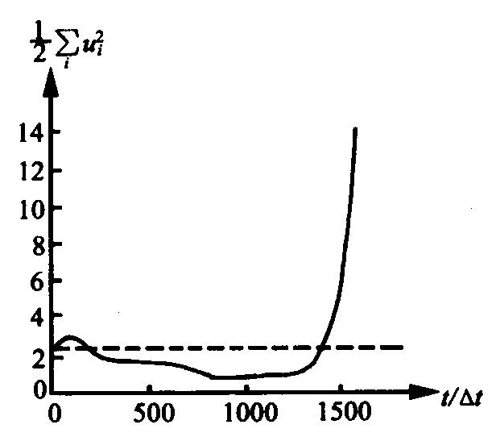
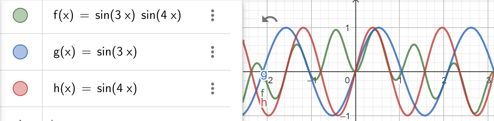
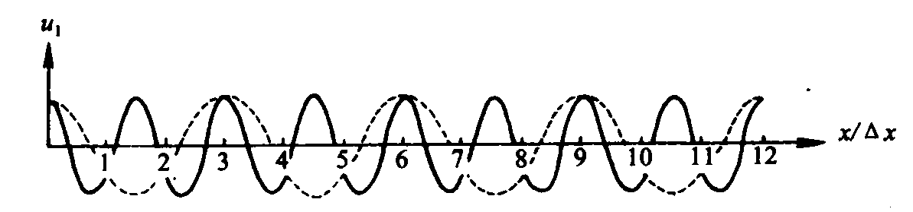

# 第二部分 

## 数值差分

现在，我们的所有基本工作都做好了，让我们捡起fortran，正式编写一个自己的程序吧！

首先，我们必须知道，在计算机是没有办法直接求解微分方程的。我们首先要做的是将现实中连续的物理量离散化。我们可以像切芒果一样，使用网格将空间切成一个个规则的立方体，这一过程叫做有限差分。当然，不但在空间上要这样处理，时间上也要进行一样的操作。


我们把网格两个边的距离称为格距，格距越小代表着空间分辨率越高；时间上的间隔称为时间步长，时间步长越小时间分辨率越高。为了方便表示，我们把每个网格都进行编号。

```fortran
! 一个表示二维空间网格的fortran程序
real :: example(i, j)
```

为了简便表示，需要先定义这些表示方法：

\[x_i=i\Delta x\]

\[t^n=n\Delta t\]

\[u^n_{i, j}=u(i\Delta x, j\Delta y, n\Delta t)\]

在离散化之后，原本连续的函数f将会变成离散的f
\[f(x)=f(i); i=range(n)\]

对于函数的变化\[\frac{\partial f}{\partial x}\]

可以用泰勒展开表示\[f(x+\Delta x)=f(x)+\frac{\partial f}{\partial x}\frac{\Delta x}{1!}+\frac{\partial^2 f}{\partial x^2}\frac{(\Delta x)^2}{2!}+...\]

移项，可得
\[\frac{\partial f}{\partial x}=\frac{f(x+\Delta x)-f(x)}{\Delta x}-\frac{\partial^2 f}{\partial x^2}\frac{(\Delta x)^2}{2!}-...=\frac{f(x+\Delta x)-f(x)}{\Delta x}+R\]

R表示截断误差，R的量级为\[O(\Delta x)\]

这种表示函数变化的方式被称为前向差分，简称为前插，在i处的前插可以表示为：
\[(\frac{\partial f}{\partial x})_i=\frac{f_{i+1}-f_i}{\Delta x}+R\]

同理，可以构造出后向差分（后插）
\[(\frac{\partial f}{\partial x})_i=\frac{f_{i}-f_{i-1}}{\Delta x}+R\]

和中央差分（中央差）
\[(\frac{\partial f}{\partial x})_i=\frac{f_{i+1}-f_{i-1}}{2\Delta x}+R\]

其中，中央差的误差是\[O(\Delta x^2)\]

想必你已经猜到了，一阶导数有对应的差分形式，二阶导数也会有对应的差分形式。这可以理所应当的推广到n阶。

比如说，对于二阶差分，前插格式为
\[(\frac{\partial^2 f}{\partial x^2})_i=\frac{\frac{f_{i+2}-f_{i+1}}{\Delta x}-\frac{f_{i+1}-f_i}{\Delta x}}{\Delta x}+R==\frac{f_{i+2}-f_i}{\Delta x^2}+R\]

接下来我们就能顺利地用差分格式替代微分格式进行数值预报了

吗？

请不要忘记我们的R。由于我们每一次差分，计算解都会产生一次误差。如果这个误差不能保持在一个合理的范围内，那我们的差分计算就会随着运算次数的增多而不再能反映微分方程原本的解，计算便失去了意义。

我们可以形象的理解这一过程：

我用相机照相，真实世界中的景物是连续的，但从相机的显示器中看到的其实是一个个像素点。如果我对着相机的显示器继续照相，再看到的画面就和真实画面有一些差别。要是我不断重复这一过程，最终画面只会完全看不出最初的景色。

为了解决这一问题，我们需要差分方案符合三个性质：

1. 相容性。相容性指的是当分辨率足够高（格距或步长趋于0）时，拍照得到的画面和真实画面完全一致（差分方程无限接近微分方程）；
2. 收敛性：每一次拍照画面的误差（每一次积分积累的误差R）能不能在分辨率足够高（格距或步长趋于0）的情况下趋向于0；
3. 稳定性：由于在计算机中浮点数都受到精度的限制，不能完全等于真实的数值，如果每一次差分这些失真都能在时间、空间分辨率趋于0时保持稳定，该差分格式就具有稳定性。

但是，我们基本上没有办法得到准确的R的——没人知道差分方程的真解到底是多少。好在拉克斯的研究证明：对于适定的线性偏微分方程组初值问题，一个与之相容的线性差分格式收敛的充分必要条件是该格式是稳定的。用人话说就是只要差分方程满足相容性和稳定性，这个差分格式就是可用的。

现在，告诉你一个好消息！我们的方程都是相容的，你基本上找不到根据上述方法处理后还不相容的方程。也就是说，我们接下来的工作重心只要放在考察方程是否稳定就好了。

### 线性计算稳定性

由于现实中的各个物理量都在一个固定的范围内浮动，比如气温最高也不会超过一百度（日本除外）。但对于数值计算来说，随着时间的增加，如果物理量一直增加，那显然就不能很好的反映现实情况了。

由于我们只需要考虑差分格式的稳定性，选取什么样的方程都无所谓。为了计算简单，我们选取一维线性平流方程来计算稳定性。
\[\frac{\partial u}{\partial t} + c\frac{\partial u}{\partial x} = 0\]

由于时间必须向前积分才有意义，时间必须使用前插或中央差。我们现在先讨论时间使用前插的情况。

我将以后插的空间格式推导如何计算线性稳定性。虽然我会告诉你空间格式为中央差的稳定性，但还是请你尝试计算。（空间格式后插的话由于是相反与平流方向更新，因此不可能存在变化，没有讨论的必要）

### 空间差分格式

由于时间必须向前积分才有意义，时间必须使用前插或中央差。我们现在先讨论时间使用前插的情况。

我将以后插的空间格式推导如何计算线性稳定性。虽然我会告诉你空间格式为中央差的稳定性，但还是请你尝试计算。（空间格式后插的话由于是相反与平流方向更新，因此不可能存在变化，没有讨论的必要）

#### 计算方式

我们展开平流方程，得到
\[\frac{u^{n+1}_{i}-u^n_{i}}{\Delta t}+c\frac{u^n_{i}-u^n_{i-1}}{\Delta x}=0\]

移项，引入参数\[\beta=c\frac{\Delta t}{\Delta x}\]

得到
\[u^{n+1}_{i}=u^n_i-\beta(u^n_{n}-u^n_{i-1})\]

由于大气具有波动性质，可以用波的指数表示
\[A\sin(kx-\omega t+\phi)=Ae^{I(kx-\omega t+\phi)}\]

将大气中的物理量表示为
\[u(x, t)=Ae^{Ik(x-ct)}=Ae^{Ikx}\cdot e^{Ikct}\]

可以将波分为振幅随时间的变化\[A^n=e^{Ikct}\]和波动在空间上的分布\[e^{Ikx}\]

则平流方程写成
\[A^{n+1}e^{Ikxi}=(1-\beta)A^{n}e^{Iki\Delta x}+\beta A^{n}e^{Ik(i-1)\Delta x}\]

引入增幅因子\[G=\frac{A^n}{A^{n-1}}=\cdots=\frac{A^2}{A^{1}}\]

平流方程写成
\[G=(1-\beta)+\beta e^{-Ik\Delta x}\]

应用欧拉公式\[e^{Ix}=\cos x+I\sin x; e^{-Ix}=\cos x-I\sin x\]

平流方程写成
\[G=1-\beta+\beta(\cos \Delta x-I\sin \Delta x)\]

只要增幅因子G≤1，差分格式就能保证稳定了。

为了去除虚数I，取模
\[|G|^2=(1-\beta+\beta\cos \Delta x)^2+(\beta I\sin \Delta x)^2=1-4\beta(1-\beta)sin^2\frac{k\Delta x}{2}\leq1\]

当\beta属于0到1时，增幅因子小于等于1。因为G≤1需要满足条件，称为条件稳定。

\[\beta=c\frac{\Delta t}{\Delta x}\leq1\]被称为CFL稳定性，表示对于固定的网格距，时间步长与波动成正比。

可以总结操作的步骤为
1. 写出差分格式的波动形式
2. 求出增幅因子
3. 分析G≤1的情况
4. 讨论稳定性

#### 前插格式的特点

由于在中纬度总是有盛行西风，根据建系规则，前插格式在中纬度其实是对着盛行风方向。所以前插格式在中纬度也被称为**迎风格式**（注意：只要差分方向与盛行风向一致就是迎风格式，所以迎风格式≠欧拉格式）

迎风格式有以下特点：
1. 条件稳定，如果减小时间或空间分辨率，另一分辨率也要相应减小
2. 增幅因子≤1，振幅不断减小，能量耗散

#### 中央差格式

对于\[\frac{u^{n+1}_{i}-u^n_{i}}{\Delta t}+c\frac{u^n_{i+1}-u^n_{i-1}}{2\Delta x}=0\]

计算得到\[|G|^2=(1-I\beta\sin k\Delta x)^2=1+\beta^2\sin^2k\Delta x\geq1\]

中央差格式又称**欧拉格式**，根据上述讨论，中央差格式不论beta取什么都会有G≥1，绝对不稳定，不能采用。

### 时间差分格式

我们之前的差分格式中，对于\[\frac{\partial u}{\partial x}\]展开的时间层都是n，也就是当下时刻。如果我的时间层不局限于n，选取n-1或者n+1，又会发生什么呢？

#### 隐式格式

我们现在考虑时间层选取未来时刻的情况。由于未来的时刻我们不能直接求解，需要额外的方程。于是我们称所有计算过程涉及未来时间层的格式为**隐式格式**。

##### 梯形隐式格式

我们现在改变思路，如果不使用n时刻的时间层计算未来的情况，会怎么样？我们可以构造n+1/2时间层的情况。

假设我知道了n+1时间的物理量，那我可以对n+1和n时刻两层取均值计算n+1/2时刻。也就是说\[\frac{\partial u}{\partial x}=\frac{\frac{u^{n+1}_{i+1}-u^{n+1}_{i-1}}{2\Delta x}+\frac{u^n_{i+1}-u^n_{i-1}}{2\Delta x}}{2}\]

此时，格式为\[\frac{u^{n+1}_{i}-u^n_{i}}{\Delta t}+c\frac{\partial u}{\partial x}=\frac{\frac{u^{n+1}_{i+1}-u^{n+1}_{i-1}}{2\Delta x}+\frac{u^n_{i+1}-u^n_{i-1}}{2\Delta x}}{2}=0\]

由于计算过程很复杂，我就不计算了，详细的过程可以参考[这个视频](https://www.bilibili.com/video/BV1La411s7CE)。不过，可以告诉你，这个格式的G恒为1。所以这个格式中性稳定，且振幅不会衰减。但是他也有很大的缺点，就是计算复杂，在设计时需要考虑性能开销。

##### 欧拉-后插格式

TBC

##### 

#### 蛙跃格式

当然，时间层除了考虑未来的情况，也可以考虑过去的情况。

现在，我们来考察时间空间都使用中央差的格式。这种格式一共用到\[f^{n+1}_{i}; f^{n}_{i-1}; f^{n}_{i-1}; f^{n-1}_{i}\]四个点，计算时就像青蛙在荷叶上蹦跳一样从n-1跳到n再跳到n+1，于是称为蛙跳格式。

让我们写出一维平流方程的差分形式
\[\frac{u^{n+1}_{i}-u^{n-1}_{i}}{2\Delta t}+c\frac{u^n_{i+1}-u^n_{i-1}}{2\Delta x}=0\]

跳过求解步骤，可以得到放大系数
\[G=\frac1G+2\omega\Delta tGI-1\]

解得
\[G_1=\sqrt{1-(\omega\Delta t)^2}+I\omega\Delta t; G_2=-\sqrt{1-(\omega\Delta t)^2}+I\omega\Delta t\]

推导过程参见[这个视频](https://www.bilibili.com/video/BV1d3411g7Qc/)

为什么会出现两个放大系数？我们先卖个关子，先总结一下蛙跃格式的性质：
1. 由于时间空间积分都用的是中央差，所以具有二阶精度，是一种很精确的格式
2. 在CFL条件下，G计算出来的结果≤1，是条件稳定
3. 波动振幅会衰减
4. 两个放大系数

### 虚假计算波

书接上回，我们计算出了两个G，根据\[G=\frac{A^{n+1}}{A^n}=\frac{u^{n+1}}{u^n}\]

可以得到两个计算解\[u_1^n=G_1u_1^0; u_2^n=G_2u_2^0\]

数值解为\[u^n=aG_1u_1^0+bG_2u_2^0=u^n_i\]其中a、b为常数。

这是怎么回事？让我们进一步考虑增幅因子G：当时间步长趋于无穷小时，有
\[
\lim_{\Delta t \to 0} G_1 = \lim_{\Delta t \to 0} \sqrt{1 - (\omega \Delta t)^2} + i \omega \Delta t = 1
\]

\[
\lim_{\Delta t \to 0} G_2 = \lim_{\Delta t \to 0} \left( -\sqrt{1 - (\omega \Delta t)^2} + i \omega \Delta t \right) = -1
\]

也就是说，G_2没有任何物理意义，被称为**计算解**或**虚假的计算波**，而G_1与物理波一致，称为物理解。

计算波的出现会导致波动产生以下性质：
1. 计算波的传播与波动方向反向，且每个时间次，计算波的振幅都会反向
2. 由于计算波和物理波叠加为最终结果，所以计算波会分走振幅，让结果与真实值更小
3. 计算解的存在使物理波速度慢于真实波，且波长越大或网格分辨率越小，物理波越接近真实波动

需要注意：由于目前向你介绍的格式中，只有蛙跃格式涉及了三个时间层，求解过程需要计算一元二次方程，才产生了计算波。其他格式不用考虑计算波的影响。

### 非线性计算不稳定

我们之前研究的都是一维线性平流方程\[\frac{\partial u}{\partial t} + c\frac{\partial u}{\partial x} = 0\]

也就是波速c是恒定的。但实际大气中流速并不是固定的，如果我们采用非线性的平流方程\[\frac{\partial u}{\partial t} + u \frac{\partial u}{\partial x} = 0\]

即便满足了格式的稳定性要求，也可能产生不稳定。比如下图所示，稳定的系统在运行了1500步后动能产生了极大的突变。这种由于非线性项产生的误差就称为非线性不稳定。接下来我们来讨论为什么会发生非线性计算不稳定。


#### 混淆误差

根据[采样定理](https://zh.wikipedia.org/zh-hans/%E9%87%87%E6%A0%B7%E5%AE%9A%E7%90%86)，我们的差分模式只能识别波长≥两倍最小分辨率的波。但很可惜，在实际的大气运动中，会产生很多不同波长的波，他们会在大气中相互作用，生成新的波，但生成的波有些会有更短的波长。比如我有两个波，它们的波数分别为k_1和k_2，它们会发生如下相互作用：

\[\sin k_1x\cdot\sin k_2x=\frac{1}{2}(\cos(k_1-k_2)x-\cos(k_1+k_2)x)\]

这时候，就产生了波数为k_1+k_2的短波。这种情况下，就会让总体的波长逐渐变短。那对于短于分辨率的波，数值模式会怎么处理呢？

在刚才的讨论中，产生了两个波：
\[wave_1=\cos(k_1-k_2)x；wave_2=\cos(k_1+k_2)x\]

对于第一个波，系统可以识别，所以无需过多讨论；对于第二个波，如果\[k_1+k_2>k_{max}=\frac{L_x}{2\Delta x}\]系统自然是无法识别的，但不代表系统会忽略掉它。相反，系统会认为这是\[k_{max}-(k_1+k_2)\]波数的波。也就是说：假如我的系统分辨率为1/5pi，他能识别的最大波数为\[\frac{2\pi}{2\Delta x}=5\]；对于波数为3和4的波叠加，就会被识别为波数3的波。



这样，波数为\[k_{max}-(k_1+k_2)\]的波就遭受了无妄之灾，能量被强行放大，导致短波能量可能会出现的迅速增长。

#### 解决方法

目前，有以下几种方法可以抑制非线性不稳定：
1. 构造守恒的差分格式
2. 加入扩散项
3. 使用谱方法
4. 由于非线性不稳定主要由短波产生，所以通过滤波的手段可以滤去短波以防混淆误差的出现

### 编程！

TBC

## 滤波

上回说到，有很多方法可以抑制非线性不稳定，其中最为常用的方法就是通过滤去短波的方法抑制非线性不稳定。

首先，为什么滤去短波可以抑制非线性不稳定？[~~让我引个流~~](https://blog.csdn.net/le0_5/article/details/135561946)是因为大气中主要影响天气系统的波动罗斯贝波就是典型的长波，而声波、重力波等短波对大尺度的天气系统影响着实有限（对中小尺度的系统就不能贸然略去短波），所以即使消掉了，也不会产生很大的影响。

有了上述的理论基础，我们就可以愉快地滤波了。

## 平滑

平滑，其实就是加权平均，是选取几个值，让他们乘以不同的权重（权重和为1），然后再相加的操作。在一维中，通常使用三点平滑

### 三点平滑

选取相邻的三个点，分别乘权S/2、(1-S)/2、S/2，即
\[\widetilde{F}^n_i=(1-S)F_i+\frac{S}{2}(F_{i+1}+F_{i-1})\]

这就是三点平滑，但注意，这无法作用于首尾两点。

接下来看看为什么平滑可以滤波：
首先对于F，可以写成波的形式

\[F_{i+n}=A\cos(kx_i+kn\Delta x+\phi)+C\]

则
\[\widetilde{F}^x_i=(1-S)(A\cos(kx_i+\phi)+C)+\frac S2(A\cos(kx_i+k\Delta x+\phi)+C+A\cos(kx_i-n\Delta x+\phi)+C)\\=C+(1-S)A\cos(kx_i+\phi)+\frac S2(2A\cos(kx_i+\phi)\cos k\Delta x)\\=C+A(1-S(1-\cos k\Delta x))\cos(kx_i+\phi)\\=A_2\cos(kx_i+kn\Delta x+\phi)+C\]

也就是说，平滑之后只会改变振幅。

定义响应函数\[R(S, L)=\frac{\widetilde{F_i}}{F_i}=1-S(1-\cos k\Delta x)=1-2S\sin^2\frac{\pi \Delta x}L\]


可以看出：
1. 响应与平滑参数S，网格分辨率，波长有关。其他参数固定时，当波长越长，响应函数越小，该波长的波受到的影响越小；
2. S绝对值越大，滤波效果越明显；
3. S为正，全部的波都削减，S为负，全部的波都增强
4. 对于多次平滑，每平滑一次，响应函数函数就自乘一次，长波会逐渐衰减

根据这些性质，可以让S交替正负，这样就既滤去了短波，又保留了长波。我们称这种平滑为**正逆平滑**。

### 五点平滑

对于二维变量，可以使用五点平滑。五点平滑的主要过程可以概括为：在x，y方向分别三点平滑后求均值。即
\[\widetilde{F}^n_{i, j}=(1-S)F_{i, j}+\frac{S}{4}(F_{i+1, j}+F_{i-1, j}+F_{i, j+1}+F_{i, j-1})\]

其响应函数为
\[R(S, k, l)=1-2S(\sin^2\frac{k\Delta x}2+\sin^2\frac{l\Delta y}2)\]

### 九点平滑

对于二维变量，还可以使用九点平滑。九点平滑的主要过程可以概括为：在x方向上沿j-1，j，j+1分别做三点平滑，然后再对这三个平滑值沿y方向做一次三点平滑。即

\[\tilde{F}_{i,j} = F_{i,j} + \frac{S}{2}(1-S)\left(F_{i+1,j} + F_{i,j+1} + F_{i-1,j} + F_{i,j-1} - 4F_{i,j}\right) + \frac{S^2}{4}\left(F_{i+1,j+1} + F_{i-1,j+1} + F_{i-1,j-1} + F_{i+1,j-1} - 4F_{i,j}\right)
\]

其响应函数为
\[R(S, k, l) = \left(1 - 2S \sin^2 \frac{k \Delta x}{2}\right) \left(1 - 2S \sin^2 \frac{l \Delta y}{2}\right)
\]

但九点平滑由于长波的衰减比五点平滑更快，因此更多选用五点平滑

### 编程！

TBC


