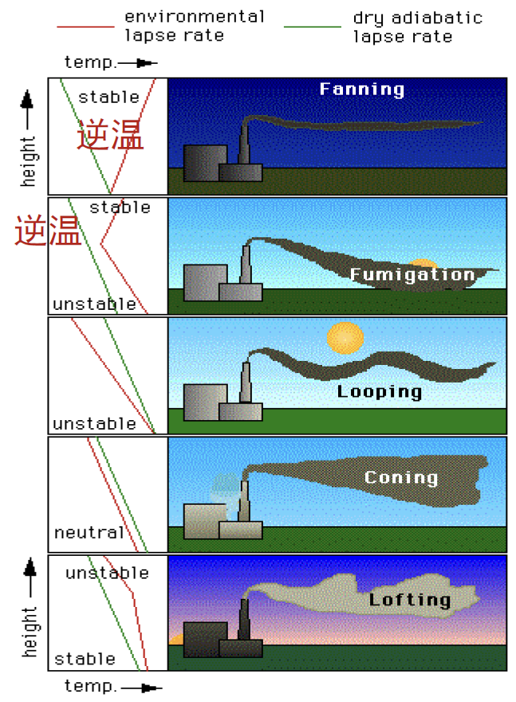
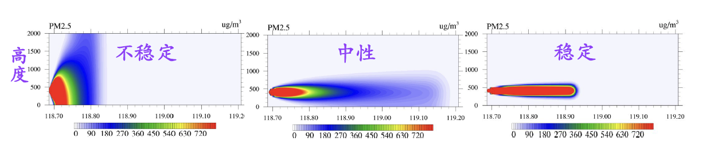
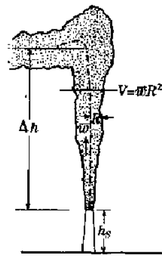

## 抽象
本笔记作用仅限于快速搭建空气污染学的知识框架，只介绍了最为核心的部分，还有很多细节尚未涉猎，很多部分也只是一笔带过。
## 空气污染的定义
由于人为或自然原因，大气组分、结构、状态发生恶化，增加了有害物质，使环境空气质量恶化，扰乱人类正常的生活生态系统。
## 空气污染物的定义
以各种方式排放进大气层并有可能对人或生物、建筑材料和整个大气环境构成危害或带来不利影响的物质
## 空气污染物的分类
1. 颗粒物，如PM2.5、PM10
2. 碳氧化物，如一氧化碳、二氧化碳
3. 氮氧化物，如一氧化氮和二氧化氮
4. 硫化物，如二氧化硫
5. 卤化物，如氟化氢、氯气
6. 碳氢化合物，如烷烃、烯烃、芳烃
7. 氧化剂
### 六大大气污染物
1. $PM2.5$
2. $PM10$
3. $CO$
4. $O_3$
5. $NO_2$
6. $SO_2$
### 颗粒物
以固体或者液体微粒形式存在于空气介质中的分散体，大小从分子大小到$10\mu m$
### 一次污染物
原始排放入大气，直接对大气造成污染的污染物质
### 二次污染物
经过化学反应生成的污染物质
## 污染物浓度
### 质量浓度
单位体积空气内含的污染物质量，单位为$mg/m^3$
### 体积浓度
污染物体积比整个空气容积，即 $\left( \frac{\text{某气体的体积}}{\text{总混合气体的体积}} \right)$，常见的单位有：百万分之一ppm（parts per million），十亿分之一ppb（parts per million）
### 换算
由状态方程$pV=nRT$，可得体积浓度 $C_V=\frac{V_{气体}}{V_{总}} $，带入状态方程，得$C_V=\frac{nRT}{p_{气体}V_{总}}$，对于质量浓度$C_m=\frac{nM}{V_{总}}$，两边利用$V_{总}$为中间项合并，得$C_V=\frac{\sout{n}RT}{\sout{n}Mp_{气体}}C_m$，在理想情况下，有$C_m=\frac{C_V\times M}{22.4}$
## 八大污染事件中与空气污染
1. 比利时马赛河谷——$SO_2$
2. 多诺拉——$SO_2$
3. 光化学烟雾——碳氧化物、氮氧化物
4. 伦敦烟雾——$SO_2$
5. 四日市——$SO_2$
6. 水俣病
7. 米糠油   
8. 骨痛病
## AQI
定量描述空气质量状况的非线性无量纲指数。其数值越大、等级和类别越高、颜色越深，代表空气污染状况越严重，对人体的健康危害也就越大。[来源](https://zh.wikipedia.org/wiki/%E7%A9%BA%E6%B0%94%E8%B4%A8%E9%87%8F%E6%8C%87%E6%95%B0)
## 计算原理
对AQI进行不同的区间划分，并假设在这些区间内，污染物的浓度都是线性分布的。因此只需要知道AQI区间内最高值和最低值对应的浓度，就可以根据给定的污染物浓度推算当前的AQI。
计算公式：线性插值公式
\[
\text{AQI} = \frac{\text{I}_{hi} - \text{I}_{lo}}{\text{C}_{hi} - \text{C}_{lo}} \times (\text{C} - \text{C}_{lo}) + \text{I}_{lo}
\]

其中：
- \(\text{I}_{hi}\) 和 \(\text{I}_{lo}\) 是对应污染物浓度范围的高值和低值的AQI
- \(\text{C}_{hi}\) 和 \(\text{C}_{lo}\) 是对应AQI范围的高值和低值的污染物浓度
- \(\text{C}\) 是测得的污染物浓度
带入以下表格的值：

| AQI范围  | PM2.5浓度范围 (µg/m³) | PM10浓度范围 (µg/m³) | O3浓度范围 (ppb) | CO浓度范围 (ppm) | SO2浓度范围 (ppb) | NO2浓度范围 (ppb) |
|----------|------------------------|-----------------------|-------------------|-------------------|--------------------|-------------------|
| 0-50     | 0.0-12.0               | 0-54                  | 0-54              | 0.0-4.4           | 0-35               | 0-53              |
| 51-100   | 12.1-35.4              | 55-154                | 55-70             | 4.5-9.4           | 36-75              | 54-100            |
| 101-150  | 35.5-55.4              | 155-254               | 71-85             | 9.5-12.4          | 76-185             | 101-360           |
| 151-200  | 55.5-150.4             | 255-354               | 86-105            | 12.5-15.4         | 186-304            | 361-649           |
| 201-300  | 150.5-250.4            | 355-424               | 106-200           | 15.5-30.4         | 305-604            | 650-1249          |
| 301-500  | 250.5-500.4            | 425-604               | 201-300           | 30.5-50.4         | 605-1004           | 1250-2049         |

使用上述公式计算得到每个污染物的AQI后取最大值为总的AQI指数。
详细内容参考[百度百科](https://baike.baidu.com/item/%E7%A9%BA%E6%B0%94%E6%8C%87%E6%95%B0/780016)或[维基百科](https://zh.wikipedia.org/wiki/%E7%A9%BA%E6%B0%94%E8%B4%A8%E9%87%8F%E6%8C%87%E6%95%B0)
## 中国的空气污染控制方法
### 浓度控制
通过控制污染源排放口排出的污染物，来控制大气环
境质量的方法。
### 总量控制
通过给定被控制区域内污染源允许排放总量，并优化
分配到源，来保证大气环境质量的方法。
## 大气环境容量
大气圈自然净化能力所允许容纳的污染物总量，在这个范围内的污染物不会破坏自然界物质循环。
## 空气污染与行星边界层
信息边界层是地球大气最下层与地球表面直接接触的部分，这一部分受到强烈的地球表面的摩擦力和地形影响。由于空气污染物多排放于这一位置，因此其与空气污染物散布密切相关。
### 边界层结构
详细请参见[边界层气象]()（还没写出来）
#### 贴底层
最靠近地表的一层，厚度小于1m，受到分子粘性力和湍流应力作用。受地表结构影响大。
#### 近地层
地表1m到50/100m。气象要素在这一层基本以垂直输送为主，基本直上直下，又被称为**常通量层**。
#### 上部摩擦层/EKman层
近地面到大气层顶，科氏力与气压梯度力和湍流应力量级相当。这层再往上的大气基本就不受地表摩擦力的影响了。
### 湍流
在流体中产生的小尺度涡旋，通常发生在流体速度很快或流动阻力很大的情况下。有以下两种原因产生。
#### 热力湍流
地表受热不均，受到明显加热的地方产生热泡，热泡在向上的过程中，带动周围的气团运动形成热力湍流。
#### 机械湍流
由于切向流速不均，剪切力使流体切向旋转，产生机械性的湍流。
## 稳定度
一般来说，冷的物质密度大，热的物质密度低。所以正常情况下，上热下冷的结构是稳定的。对于大气，如果下热上冷，下层大气就会受浮力抬升，不容易回到原来的位置，此时就是不稳定。通过环境温度直减率$\tau$和绝热减温率$\tau_m$可以定量分析。
其中：

- $\tau=-\frac{dT}{dz}$
- $\tau_m$为干空气的温度直减率
如果环境温度直减率大于绝热减温率，说明环境大气降温的速度比干绝热过程大。此时气块依照干绝热过程上升，温度比环境大气更大，因此会继续上升，不稳定；
如果环境温度直减率小于绝热减温率，气块温度比环境温度小，会落回去，因此稳定。
### 对作用空气污染的作用
一般来说，稳定的大气意味着污染物更容易随着抬升扩散，不稳定的大气则容易使污染物堆积，爆发污染。
### 逆温
一般来说，地表大气受到地面加热作用，会比相对高层的大气温度更高。因此在对流层内对流才是常态。但是，如果下层温度相对更低，这种情况逆于常态，于是称这种温度分布为逆温。在逆温的情况下，往往大气层结是稳定的。
#### 逆温类型
至于底层大气为什么比高层大气温度低，有以下几个可能的原因
##### 辐射逆温
地表降温速度比大气快，当地表失去热量供给后，温度迅速降低，使下层大气跟着降温。这时产生的逆温称为辐射逆温。这种逆温通常出现在晚上。
##### 平流逆温
这种逆温产生的原因和辐射逆温类似，都是因为地面温度低，使底层大气降温。但不同之处在于平流逆温中，地表的低温是由于暖空气平流到了相对冷的地面。此时相对暖的大气，地表更冷，使暖空气变冷。
##### 下沉逆温
在下沉运动中，空气被压缩变热，使中层大气于下层大气的温差变小，神传可能使中层大气比下层大气更热，此时产生逆温。
##### 地形逆温
地形逆温是由于某些原因地表散热速度大于高空，产生下热上冷的情况。
典型的情况为山谷谷底夜间降温。
##### 锋面逆温
当暖锋过境，暖空气抬升，上热下冷，产生逆温
##### 湍流逆温
低层空气在湍流的作用下可能夹卷上层的空气，使空气混合，混合后的环境温度直减率将会减小，有利于产生逆温。
### 辐射影响
根据[辐射逆温](#####辐射逆温)方面，辐射强的地区大气一般不稳定，辐射弱的地方大气一般容易形成逆温，比较稳定。
如果地区多云，则会反射辐射，易于产生逆温，使大气层结稳定
## 污染烟形
根据排放源上方与下方大气的稳定类型，可以将污染物扩散类型分为以下几种：
由上至下分别是扇型、熏烟型、波浪型、锥型、屋脊型

### 扇型
当上下层都是稳定的情况下，污染物无论向上还是向下受到阻力，只能在水平方向上扩散。此时的烟型垂直来看呈现扇面结构，称为扇型
### 熏烟型
当上层大气稳定，下层大气不稳定，污染物容易向下扩散，对更低的位置产生污染，此时称为熏烟型
### 波浪型
当当上下层大气都不稳定，污染物可以肆意扩散，因此容易形成波浪形的轨迹，此时烟型为波浪型
### 锥型
当大气层结为中性的时候，污染物扩散既没有动力也没有阻力，于是会自发的像扇形扩散。立体来看好似锥体，称为锥型
### 屋脊型
对于上部不稳定，下部稳定的大气，污染物倾向向上扩散，产生屋脊状的烟型
## 天气形势影响污染
天气形势也会影响污染扩散。
比如低压抬升，容易使污染物向上空扩散；抬升产生的降水也会对污染物起到湿沉降作用降低污染
## 下垫面环流
下垫面产生的中尺度环流会产生空气的平流，使污染物被吹至不同的地方（下风向）。
### 海（湖）陆风环流
由于水面与陆面的热力差异，白天会产生海风，晚上会产生陆风。
### 山谷风环流
由于谷底地形封闭，气温变化速度慢于山坡，因此白天吹谷风，晚上吹山风
### 热岛效应
城市由于工业和集中供暖，一般会比郊区温度高。此时郊区会有风吹向市区，使市区的污染不易向外扩散。
## 描述扩散的方法
根据流体力学中描述流体运动的方法，可以分为摄像机跟随流体运动的拉格朗日方法和摄像机不动的欧拉方法
### 欧拉方法
使用固定坐标，描述流体运动使用偏导数。还原流体运动需要额外的平流项。
即：$\frac{d}{dt}=\frac{\partial}{\partial t}+\nabla$

### 拉格朗日方法
使用跟随坐标，描述流体运动用全导数，可以直接描述流体运动。
### 扩散理论
假设大气在平稳均匀的湍流场下的扩散符合正态分布
\[ f(x) = \frac{1}{\sqrt{2\pi\sigma^2}} \exp\left( -\frac{(x - \mu)^2}{2\sigma^2} \right)（一维） \]
\[ f(x, y) = \frac{1}{2\pi\sigma_x \sigma_y} \exp\left( -\left[ \frac{(x - \mu_x)^2}{2\sigma_x^2} + \frac{(y - \mu_y)^2}{2\sigma_y^2} \right] \right) （二维）\]
\[ 
f(x, y, z) = \frac{1}{(2\pi)^{3/2} \sigma_x \sigma_y \sigma_z} \exp\left[ -\left( \frac{(x - \mu_x)^2}{2\sigma_x^2} + \frac{(y - \mu_y)^2}{2\sigma_y^2} + \frac{(z - \mu_z)^2}{2\sigma_z^2} \right) \right] （三维）
\]

### 扩散参数
根据三维正态分布，可以类推出来高斯-拉格朗日方法的扩散方程
\[ 
c(x, y, z) = \frac{q}{(2\pi)^{3/2} \sigma_x \sigma_y \sigma_z} \exp\left[ -\left( \frac{(x - \mu_x)^2}{2\sigma_x^2} + \frac{(y- \mu_y)^2}{2\sigma_y^2} + \frac{(z-\mu_z)^2}{2\sigma_z^2} \right) \right] 
\]
其中，q为基础正态分布上的系数，用来描述污染源排放污染的能力，称为**源强**
在正态分布中，为了方便描述污染物，将表征离群程度（扩散能力）正态分布的方差称为**扩散参数**。一般在水平方向上和垂直方向上使用不同的扩散参数$\sigma_x$、$\sigma_z$ 和$\sigma_z$
对于静风的情况，$\mu_x$、$\mu_y$、$\mu_z$均等于0，若有风，则改写成$\mu=Vt$
### 云宽
即烟流边界，沿着横风向，污染物浓度下降到轴线浓度的1/10处两点的距离。
根据扩散方程，$\frac{c_0}{10}=c_0e^{-\frac{x_0^2}{2\sigma^2}}$，可得云宽为$2x=x\times2.15\sigma$
### 有界高架点源
此时，改写$\mu_z=H$
### 考虑地面反射
类似于光学的反射，将地面以下H高度假设一个虚源，于是z轴新增一项
\[ 
c(x, y, z, H) = \frac{q}{(2\pi)^{3/2} \sigma_x \sigma_y \sigma_z} \exp\left[ -\left( \frac{(x - \mu_x)^2}{2\sigma_x^2} + \frac{(y- \mu_y)^2}{2\sigma_y^2} + \frac{(z-H)^2}{2\sigma_z^2} + \frac{(z+H)^2}{2\sigma_z^2} \right) \right] 
\]
### 地面最大浓度
对于扩散方程$c(x, y, z, H)$，当z=0时，表征地面的浓度曲线；当y为0时表征在轴线上。因此地面最大浓度存在于$\frac{\partial c(x, 0, 0, H)}{\partial x}=0$处
### 稳定度对轴线的影响
稳定度越大，$\sigma$小。

### 扩散参数获取方法
#### P-G方法/P-G-T方法
根据云况、日射、地面风速将大气分为A（最不稳定）到F（最稳定）级
太阳高度角计算方式
\[
\sin\theta = \sin\varphi\sin\delta + \cos\varphi\cos\delta\cos\omega
\]

其中：
- \(\theta\) — 太阳高度角；
- \(\varphi\) — 地理纬度；
- \(\delta\) — 太阳倾角，赤纬，可在天文年历中查到；
- \(\omega\) — 时角，以正午为零，下午取正值，每小时的时角为15°；

\[
\omega = (t - 12) \times 15°
\]

其中，\( t \) 为地方时。

| 太阳高度角 (°) | >60  | 35~60 | 15~35 | <15  |
|----------------|------|-------|-------|------|
| 日射强度       | 强   | 中等  | 轻度  | 微弱 |
| 日射等级       | 4    | 3     | 2     | 1    |

| 时间                | 天空状况                                    | 日射等级 |
|---------------------|---------------------------------------------|----------|
| 无论日间或夜间       | 总云量10/10, 而且云高<2000m                 | 0        |
|                     | 总云量<4/10                                 | -2       |
| 夜间                | 总云量>4/10                                 | -1       |
|                     | h<15º                                       | 1        |
|                     | 15º<h<35º                                   | 2        |
|                     | 35º<h<60º                                   | 3        |
|                     | h>60º                                       | 4        |
| 日间                | 云高为<2000m的低云量6~9, 且:                  |          |
|                     | h>60º                                       | 1        |
|                     | h<60º                                       | 0        |
|                     | 云高<2000米的低云量>9, 不论h                  | 0        |

| 地面风速 (m/s) | 4     | 3     | 2     | 1     | 0     | -1    | -2    |
|----------------|-------|-------|-------|-------|-------|-------|-------|
| <2             | A     | A~B   | B     | C     | D     | E     | F     |
| 2~3            | A~B   | B     | C     | D     | D     | D~E   | E     |
| 3~5            | B     | B~C   | C     | D     | D     | D     | D~E   |
| 5~6            | C     | C     | D     | D     | D     | D     | D~E   |
| >6             | C     | D     | D     | D     | D     | D     | D     |

最后根据稳定度等级带入P-G扩散曲线图得到扩散参数
#### 国标法计算
在P-G方法上进行以下重构：
##### 1. 太阳高度角
\[
\theta = \arcsin\left[\sin\varphi\sin\delta + \cos\varphi\cos\delta\cos(15t + \lambda - 300)\right]
\]

其中：
- \(\varphi\)：地理纬度
- \(\delta\)：太阳倾角、赤纬
- \(t\)：地方时
- \(\lambda\)：当地经度
\[
\delta = \left[0.006918 - 0.399912\cos\theta_0 + 0.070257\sin\theta_0 - 0.006758\cos2\theta_0 + 0.000907\sin2\theta_0 - 0.002697\cos3\theta_0 + 0.001480\sin3\theta_0\right] \cdot \frac{180}{\pi}
\]

其中：
- \(\theta_0 = \frac{360d_n}{365}(\circ)\)
- \(d_n\) 为一年中日期的序数 \(1, 2, 3, \ldots, 365\)
##### 2. 太阳辐射等级数

| 总云量/低云量 | 夜间  | \( h \leq 15^\circ \) | \( 15^\circ < h \leq 35^\circ \) | \( 35^\circ < h \leq 65^\circ \) | \( h > 65^\circ \) |
|---------------|-------|----------------------|---------------------------------|---------------------------------|---------------------|
| \(\leq 4/ \leq 4\) | -2  | -2                   | -1                              | +1                              | +3                  |
| 5~7/\(\leq 4\)     |   -1    | -1                   | 0                               | +1                              | +3                  |
| \(\geq 8/\leq 4\)  |    -1   | -1                   | 0                               | +1                              | +1                  |
| \(\geq 5/5~7\)     |    0   | 0                    | 0                               | +1                              | +1                  |
| \(\geq 8/\geq 8\)  |    0   | 0                    | 0                               | 0                               | 0                   |

##### 3. 太阳辐射等级

| 地面风速 (m/s) | +3   | +2   | +1   | 0    | -1   | -2   |
|----------------|------|------|------|------|------|------|
| \(\leq 1.9\)   | A    | A~B  | B    | D    | E    | F    |
| 2~2.9          | A~B  | B    | C    | D    | E    | F    |
| 3~4.9          | B    | B~C  | C    | D    | D    | E    |
| 5~5.9          | C    | C~D  | D    | D    | D    | D    |
| \(\geq 6\)     | D    | D    | D    | D    | D    | D    |

##### 4. 扩散参数确认、下垫面影响、采用时间修正
太长了，参考[这份文章第36-39页](https://air.sjtu.edu.cn/Assets/userfiles/sys_eb538c1c-65ff-4e82-8e6a-a1ef01127fed/files/%E7%AC%AC%E5%9B%9B%E7%AB%A0%E5%A4%A7%E6%B0%94%E6%B1%A1%E6%9F%93%E6%89%A9%E6%95%A3%E6%A8%A1%E5%BC%8F%E5%8F%8A%E7%8E%AF%E5%A2%83%E7%A9%BA%E6%B0%94%E8%B4%A8%E9%87%8F(1).pdf)

### 烟流抬升

对于有效源高H，计算方式为$H=h_s+\Delta h$，其中：
- $h_s$为烟囱几何高度
- $\Delta h$为抬升高度
#### 影响因子
1. **动力：** 烟气排放的出口速度
2. **热力：** 烟气温度与环境温度的关系
#### 阶段
##### 喷出阶段
烟气刚喷出的时候，具有初始动量。在上升过程中逐渐混合，抬升因子从动力转换为浮力。
##### 浮力阶段
由于烟气温度大于环境温度产生的浮力，在动力减弱后起主导作用。随着烟气与环境温差减小而减弱。
##### 瓦解阶段
动力、浮力抬升双双减弱，主要受到自生湍流影响，烟流抬升基本停止。
##### 变平阶段
大气中的湍涡起主导作用，抬升完全停止，烟流变平。
#### 影响要素
1. **排放源及排放烟气的性质：** 决定初始动量和浮力，主要影响喷出阶段和浮力阶段。
2. **环境大气的性质：** 影响烟流与周围大气混合的速率
3. **下垫面性质：** 影响湍流强弱
### 高斯烟流修正
在扩散过程中，会有很多其他因素影响扩散，如抬升作用，下垫面等。
考虑以下三个方面：
1. 干清除
2. 湿清除
3. 化学反应
可以从以下几个方面修正高斯扩散公式
\[ 
c(x, y, z, H) = \frac{q}{(2\pi)^{3/2} \sigma_x \sigma_y \sigma_z} \exp\left[ -\left( \frac{(x - \mu_x)^2}{2\sigma_x^2} + \frac{(y- \mu_y)^2}{2\sigma_y^2} + \frac{(z-H)^2}{2\sigma_z^2} + \frac{(z+H)^2}{2\sigma_z^2} \right) \right] 
\]
#### 源强
由于小粒子的沉降作用，可以把源强q修正为有效源强
\[
q(x) = q \left[ \exp \left( \int_0^x \frac{1}{\sigma_z e^{\frac{H^2}{2\sigma_z^2}}} \, dx \right) \right]^{-\sqrt{\frac{2}{z} \frac{v_d}{u}}}
\]
#### 污染物滞留时间
假设污染物的清除效率为指数倍，则可以参考~~v社著名游戏半条命~~半衰期的概念，可以构造出**污染物滞留时间**的概念：即假定没有污染物补充，没有污染物穿过区域边界，该区域大气里污染随时间减少至原来的1/e倍所需的时间。
同时，污染物也可以使用**半衰期**的概念，此时将上述概念重构为衰减至1/2倍，得到$T_{\frac{1}{2}}$
于是可以乘上一项
\[
\exp[-\frac{0.693x}{T_{\frac{1}{2}}\bar u}]
\]
#### 大粒子沉降系数
在$\frac{(z - \mu_z)^2}{2\sigma_z^2}$上增加一项大粒子沉降项，
得到$\frac{(z - H+\frac{v_sx}{\bar u})^2}{2\sigma_z^2}$
#### 地面反射系数
对地面反射项，可以乘上一个地面反射项$\alpha$
#### 修正后的公式
\[ 
c(x, y, z, H) = \frac{q(x)}{(2\pi)^{3/2} \sigma_x \sigma_y \sigma_z} \exp\left[ -\left( \frac{(x - \mu_x)^2}{2\sigma_x^2} + \frac{(y- \mu_y)^2}{2\sigma_y^2} + \frac{(z-H+\frac{v_sx}{\bar u})^2}{2\sigma_z^2} + \alpha\frac{(z+H-\frac{v_sx}{\bar u})^2}{2\sigma_z^2} \right) \right] \cdot\exp[-\frac{0.693x}{T_{\frac{1}{2}}\bar u}]
\]
## 三线一单
1. 生态保护红线
2. 环境质量底线
3. 资源利用上线
4. 生态环境准入清单
## 传输模式
传输模式根据维度可以分为：
1. 一维：箱模式c(t)
2. 二维：柱模式c(z, t)
3. 二维：c(x, z. t)
4. 三维：c(x, y, z, t)
### 欧拉模式
定义原理：输入-输出=变化
由以下几个可能的输入输出：
1. 化学反应
2. 化学损耗
3. 排放
4. 沉降
5. 流入流出

则对于单个污染物浓度，有
\[\frac{dm_i}{dt}=Production+Loss+Emission+Deposion+Inflow+Outflow=S-km_i\]
其中
- $km_i$为耗散率
- S为来源率

对于多个箱体相互作用的情况，一个箱体的总损耗为自身的损耗和向其他箱体传输的部分。通过这一关系可以构建质量平衡方程。
则有
\[\frac{dm_i}{dt}=Rate_i+Emission_i+Deposion_i+Inflow+Outflow\]
Rate为化学反应速率
在箱内，若风速风向恒定，有
\[\frac{dc_i\Delta x\Delta yH}{dt}=Rate_i\Delta x\Delta yH+Emission_i+Deposion_i+uH\Delta y(c^0_i-c_i)\]
## 拉格朗日模式的计算
当使用拉格朗日观点时，没有流入流出项，公式重构为
\[\frac{dm_i}{dt}=Rate_i+Emission_i+Deposion_i\]
