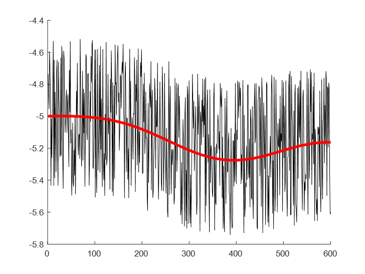

## 湍流
为了描述边界层中大气的运动，我们需要知道一些用于解析边界层的物理概念与方法。

先看一组真实世界中的气温-时间序列：

如果不看红线，只会感觉密密麻麻的，似乎没什么特别。但是加上这条红线，就可以看出点端倪：我们测得的物理量都在这个红线附近波动，而红线本身又呈现波的形状。

也就是说，真实世界中，流体的流动形式有以下三种：
平均运动 $\bar A$，波动 $A'$和湍流运动$A''$ 。也就是说，任何一个变量都能写成 $A=\bar A+A'+A''$ ！换种方法说，流体运动是平均运动、波动和湍流三者的叠加。

这和[动力气象学中的波动]()类似，只不过动力气象学中研究的是自由大气，所以可以忽略湍流的作用。

但是，我们讲了半天，到底什么是**湍流 (turbulence)**呢？

### 什么是湍流

一般提起流体，我们很容易想到水流，比如水喉流出的水。一般来说，如果流量很小的话，水流呈现出比较稳定的结构

在这些情况下，流体质点彼此互不混杂，质点运动轨迹呈平滑直线的流动。我们称这样的运动为**层流 (laminar)**。

但是，如果一下把出水量跳到最大，那么水流就不再是像图上这样流动了，而是喷涌而出。

这种喷涌而出的水流就被称为**湍流 (turbulence)**。

但是说来惭愧，目前湍流仍然没有一个准确的定义，只有以下几种主流的定性描述：
1. Von.Karman和I.G Taylor对湍流的定义：湍流是流体和气体中出现的一种无规则流动现象。
2. Hinze对湍流的定义为：只提不规则运动不全面，“湍流的各个量在时间和空间上表现出随机性。
3. 周培源：湍流为一种不规则的涡旋(eddy)运动。

为了规范，我们不妨采取Hinze与Taylor说法的叠加：湍流是流体和气体中出现的一种无规则流动现象，并且湍流的各个量在时间和空间上表现出随机性。也就是说，我们看到水枪喷射出来，飞溅的水、工厂排出乱飘的烟都是湍流。

综上，湍流与层流的区别如图所示

### 湍流的产生机制
雷诺（Reynold）在1883年做了一个[实验](https://www.youtube.com/watch?v=y0WRJtXvpSo)（不能播放的话可以看看这个[比较长的版本](https://www.bilibili.com/video/BV14U4y1f7K7)）验证湍流的产生机制。

他发现流体呈现湍流还是层流运动主要取决于：
1. 流体流速
2. 管子直径
3. 液体性质

根据这个性质，他得出了雷诺数（Reynolds number）：

$$
\text{Re}=\frac{\rho U L}{\mu}=\frac{U L}{\nu}
$$

其中 $\nu=\frac{\mu}{\rho}$ ，表示运动粘度。
关于这个式子具体的介绍，我会放在[动力学基础]()中（如果我想得起来更的话XD）

通过计算雷诺数，我们可以得到湍流的运动类型式层流还是湍流。当雷诺数大于临界雷诺数 $Re_c$ 时，流体从层流转变。

不过，雷诺数只是一个用于鉴别流体运动类型的工具，不能反映湍流的产生机制。一般来说，在大气中，湍流主要有两个产生机制：对流热泡和速度梯度。

#### 对流热泡
根据之前对于湍流的示意图，湍流的组织形式可以看作一个个小的涡旋 (专业称呼为湍涡，eddy)。你可以利用湍涡对湍流加深理解：**湍流可以看成叠加上许多湍涡的平流运动流体**。

当地面受到太阳辐射加热后，某些受到辐射量比较大的地面温度就会高于周围。热量传导到大气中，就产生了局地的高温热泡。如图所示

当热泡上升脱离地面后（详细的描述可以参考[这篇文章的 “2、成因” 部分](https://daily.zhihu.com/story/8113698)），会因为失去能量源而破碎。破碎的热泡就像浴缸中的泡泡一样变成更小的泡泡，这些小泡泡就是湍涡。

#### 剪切作用
第二种情况是风的剪切作用。当风吹过地表，受到地表的阻曳作用，靠近地表的风速会小于远离地表的风速。

这种风的垂直切变会让气团旋转，产生涡旋。比如图中右边这个风速切变就会产生顺时针的涡旋。这些涡旋也会破碎产生小的湍涡。

### 湍流的研究方法
现在我们知道了湍流的产生机制，接下来就要开始正式研究湍流了。

#### 泰勒假设
首先，我们应该获取湍流的资料。但是，由于流体在无时无刻的运动，湍涡也在不停的生消发展，我们该怎么测量一个无时无刻在变化的量呢？在1938年，泰勒（I.G Tylor）提出：**在特定条件下，湍流平移经过传感器时，可以将它看成凝固的。** 即，如果 $\frac{d\xi}{dt} = 0$ ，则有

$$
\frac{d\xi}{dt} = \frac{\partial \xi}{\partial t} + U \frac{\partial \xi}{\partial x} + V \frac{\partial \xi}{\partial y} + W \frac{\partial \xi}{\partial z}
$$

也就是

$$
\frac{\partial \xi}{\partial t} = - U \frac{\partial \xi}{\partial x} - V \frac{\partial \xi}{\partial y} - W \frac{\partial \xi}{\partial z}
$$

这样，区域内物理量随时间的变化就可以通过泰勒假设间接地通过排除时间变量求得。而根据 $\frac{d\xi}{dt} = 0$ ，可知其适用于湍强不太大、风速不太小、均匀湍流、平稳湍流的地区。也就是说，这个方法只能用于获取稳态流动中的湍流信息。

#### 雷诺平均
现在我们算是解决了资料的问题了。接下来，我们需要做另一件事：解方程。

我们知道，大气科学，乃至流体力学，都在试图解决一个核心的问题：Navier-Stokes方程（NS方程）

$$
\rho \left( \frac{\partial \mathbf{u}}{\partial t} + (\mathbf{u} \cdot \nabla)\mathbf{u} \right) = -\nabla p + \mu \nabla^2 \mathbf{u} + \mathbf{f}
$$ 

或者写成大气科学领域更为熟悉的方式

$$
\frac{d\vec{V}_h}{dt} = -f \vec{k} \times \vec{V} - \frac{1}{\rho} \nabla P
$$

但是，众所周知，这是一个极其难以求解的，高度非线性的方程，我们必须使用一些技巧来辅助我们求解。在计算流体力学（Computational Fluid Dynamics, CFD）中有两个常用的方法：雷诺平均方法（Reynolds-Averaged Navier-Stokes, RANS）和大涡模拟方法（Large Eddy Simulation, LES）。我们先介绍更为常见RANS方法，如果后续有需要的话，我再更新[LES方法]()。

虽然湍流运动是随机且复杂的，但对于雷诺平均方法，我们可以采用统计的思想从计算瞬时态的流场转为计算均态的流场来曲线救国。像分析波动一样，雷诺平均的思想是将流体中的物理量表示为代表流体变化趋势的**均值**与代表湍流脉动的**扰动**，即对于任意物理量，均有 $A=\bar A+A'$。其中 $\bar A=\frac{1}{T}\int_0^T Adt$。如果我们取一个合适的时间，比如大于脉动周期，而小于流体的特征时间尺度。这样，由于时间大于脉动周期，可以去除随机性产生的影响；小于特征尺度可以防止流体的主要信息被一并消去。

然后，我们再对平均化做出如下规则约束：
1. $\overline{\bar A}=\bar A$， $\overline{A'}=0$,  $\overline{A'B'}\neq0$
2. $\overline{\bar A+A'}=\bar A+0=\bar A$
3. $\overline{(\bar A+A')\cdot(\bar B+B')}=\overline{\bar AB'+\bar A\bar B+A'\bar B+A'B'}=\overline{\bar A\bar B}+\overline{A'B'}=0$

整个过程可以总结为：只保留纯的平均量或者扰动的二次项（因为扰动的平均是0，而扰动乘上扰动的平均却不一定为0，比如 $\lim_{x\rightarrow0}x\sin(\frac{1}{x})$ ）。

同时，为了表达式简洁，我们再引入该死的[张量标识法](./basis.markdown#张量表示法)。

首先，在用张量表示的各个控制方程如下：

1. 动量方程： $\frac{\partial u_i}{\partial t}+u_j\frac{\partial u_i}{\partial x_j}=-\frac1\rho\frac{\partial p}{\partial x_i}+\epsilon_{i3}g+f\epsilon_{ij3}u_j+\nu\frac{\partial^2 u_i}{{\partial x_j}^2}$
2. 水汽方程： $\frac{\partial q}{\partial t} + u_j \frac{\partial q}{\partial x_i} = \nu_q \frac{\partial^2 q}{\partial x_i^2} + \frac{S_q}{\rho} + \frac{E}{\rho}$
3. 状态方程： $p=\rho RT$
4. 热流量方程： $\frac{\partial\theta}{\partial t}+u_j\frac{\partial\theta}{\partial x_j}=\nu_\theta\frac{\partial^2\theta}{{\partial x_j}^2}-\frac{1}{\rho C_p} \frac{\partial Q_j^*}{\partial x_j} - \frac{L_v E}{\rho C_p}$
5. 不可压近似下的连续方程： $\frac{u_j}{x_j}=0$

每项的物理意义与推导详见[大气运动的基本方程](./equations.md)。接下来，我们将对每个基本方程计算雷诺平均。

##### 动量方程
对于

$$
\frac{\partial u_i}{\partial t}+u_j\frac{\partial u_i}{\partial x_j}=-\frac1\rho\frac{\partial p}{\partial x_i}+\epsilon_{i3}g+f\epsilon_{ij3}u_j+\nu\frac{\partial^2 u_i}{{\partial x_j}^2}
$$

将速度和压力进行雷诺分解： $u_i = \overline{u_i} + u_i', \quad p = \overline{p} + p'$ 。由于密度的扰动相对自身不大，所以这里不分解密度项。

代入原方程，得到：

$$
\frac{\partial (\overline{u_i} + u_i')}{\partial t} + (\overline{u_j} + u_j') \frac{\partial (\overline{u_i} + u_i')}{\partial x_j} = -\frac{1}{\rho} \frac{\partial (\overline{p} + p')}{\partial x_i} + \epsilon_{i3} g + f \epsilon_{ij3} (\overline{u_j} + u_j') + \nu \frac{\partial^2 (\overline{u_i} + u_i')}{\partial x_j^2}
$$

求时间平均，得到

$$
\frac{\partial \overline{u_i}}{\partial t} + \overline{u_j} \frac{\partial \overline{u_i}}{\partial x_j} = -\frac{1}{\rho} \frac{\partial \overline{p}}{\partial x_i} + \epsilon_{i3} g + f \epsilon_{ij3} \overline{u_j} + \nu \frac{\partial^2 \overline{u_i}}{\partial x_j^2} - \frac{\partial \overline{u_i' u_j'}}{\partial x_j}
$$

上式便是RANS的动量方程。可以发现，这个方程与最初的方程有很大的相似之处：在把原方程所有的速度和气压取了平均然后多出了一项 

使用还没求平均的动量方程与RANS动量方程相减，可以得到扰动方程 $\frac{\partial \overline{u_i' u_j'}}{\partial x_j}$ 。这项被称为雷诺应力项，表示由于速度扰动引起的动量传输，也就是湍流粘性应力。我们可以说雷诺应力$\frac{\partial \overline{u_i' u_j'}}{\partial x_j}$ （其中i, j是确切的量）是通过 $u_i$ 方向的面向  $u_j$方向传输的脉动动量。接下来我将向你证明为什么可以这么说。首先借用一下别人的图来演示，所以请忽视图上的文字。

对于一个雷诺应力分量，比如说上表面的x方向 

$$
\frac{\partial \overline{u_3' u_1'}}{\partial x_1}=\frac{\partial \overline{w' u'}}{\partial x}
$$ 

如果将将单位质量（也就是密度）还给它，就会变成这样

$$
\overline{\bar\rho w' u'}
$$

对于这个分量，是不是很像动量 $Ft=MV$ ？如果你没看明白，那我再对它动点手脚：
$$
Ft=MV \Rightarrow F=\frac{MV}{t}=\frac{ML^3V}{L^3t}=\frac{\rho LVS}{t}={\rho V_1V_2S}
$$

如果是单位面积 （ $S=1$ ），那就和上面的雷诺应力完全一致了！（虽然实际上这样的证明是很不严谨的）这样看来，雷诺应力是一个作用于流体微团表面的力。我们可以把流体微团看成一个微小的立方体。对于这个立方体，有上下，左右，前后三个轴向的面，每个方向的面也能受到x, y, z三个方向的力。也就是说，湍流粘性力，雷诺应力，实质上是湍流对流体微团表面动量的输送。

继续，我们可以用 $\tau_{31}=\overline{\bar\rho w' u'}$ 表示上下表面在x轴上的湍流粘性力。对于流体微团，下表面的湍流粘性应力为 $\tau_{31}|_z$ ，上表面为 $\tau_{31}+|_{z+dz}$ 两个面产生的合力即为 $\frac{(\tau_{31}|_{z}-\tau_{31}|_{z+dz})dxdy}{dxdydz}=\frac{\partial \overline{\bar\rho w' u'}}{\partial x}$。

如果用雷诺展开方程减去雷诺时均方程，就可以得到

$$
\frac{\partial u_i'}{\partial t} + \overline{u_j} \frac{\partial u_i'}{\partial x_j} + u_j' \frac{\partial \overline{u_i}}{\partial x_j} + u_j' \frac{\partial u_i'}{\partial x_j} + \overline{u_j} \frac{\partial u_i'}{\partial x_j} = \delta_{i3} g \frac{\theta_v'}{\overline{\theta_v}} + f \epsilon_{ij3} u_j' - \frac{1}{\rho} \frac{\partial p'}{\partial x_i} + \nu \frac{\partial^2 u_i'}{\partial x_j^2} + \frac{\partial \overline{u_i' u_j'}}{\partial x_j}
$$

这条充满了脉动的方程，我们称之为**脉动方程**。这条方程表征的是湍流脉动的变化。

##### 水汽方程
根据我们对于动量方程的处理，我们可以总结导出雷诺时均方程操作流程：
1. 将物理量雷诺展开成平均量与扰动量
2. 对展开后的方程求时间平均
3. 得到平均方程
4. 平均方程减去原方程的平均
5. 得到脉动方程

应用这套流程

由水汽方程

$$
\frac{\partial q}{\partial t} + u_j \frac{\partial q}{\partial x_i} = \nu_q \frac{\partial^2 q}{\partial x_i^2} + \frac{S_q}{\rho} + \frac{E}{\rho}
$$

对水汽含量、速度进行雷诺分解

$$
q = \overline{q} + q', \quad u_j = \overline{u_j} + u_j'
$$

代入原方程并求平均， 最终得到水汽的平均方程

$$
\frac{\partial \overline{q}}{\partial t} + \overline{u_j} \frac{\partial \overline{q}}{\partial x_i} = \nu_q \frac{\partial^2 \overline{q}}{\partial x_i^2} + \frac{\overline{S_q}}{\overline{\rho}} + \frac{\overline{E}}{\overline{\rho}} - \frac{\partial \overline{u_j' q'}}{\partial x_i}
$$

与脉动方程

$$
\frac{\partial q'}{\partial t} + \overline{u_j} \frac{\partial q'}{\partial x_j} + u_j' \frac{\partial \overline{q}}{\partial x_j} + u_j' \frac{\partial q'}{\partial x_j} + \overline{u_j} \frac{\partial q'}{\partial x_j} = \nu_q \frac{\partial^2 q'}{\partial x_j^2} + \frac{\partial \overline{u_j' q'}}{\partial x_j}
$$

其中 $\frac{\partial \overline{u_j' q'}}{\partial x_i}$ 项与雷诺应力项类似，也是湍流作用项，但这项作用的不再是对动量而是水汽的输送作用。

##### 状态方程
对于状态方程

$$
p = \rho R T
$$

对压力、密度和温度进行雷诺分解

$$
p = \overline{p} + p', \quad \rho = \overline{\rho} + \rho', \quad T = \overline{T} + T'
$$

代入状态方程

$$
\overline{p} + p' = (\overline{\rho} + \rho')R(\overline{T} + T')
$$

并求平均得到平均方程

$$
\overline{p} = R(\overline{\bar\rho\bar T}+\overline{\rho'T'})
$$

##### 连续方程
由于连续方程实在是太简单了（在0级近似的情况下），这里就不推导了，直接给出连续方程的平均方程

$$
\frac{\bar u_j}{x_j}=0
$$

与扰动方程

$$
\frac{u'_j}{x_j}=0
$$

##### 热流量方程
对热流量方程

$$
\frac{\partial \theta}{\partial t} + u_j \frac{\partial \theta}{\partial x_j} = \nu_\theta \frac{\partial^2 \theta}{\partial x_j^2} - \frac{1}{\rho C_p} \frac{\partial Q_j^*}{\partial x_j} - \frac{L_v E}{\rho C_p}
$$

的温度、速度等进行雷诺分解

$$
\theta = \overline{\theta} + \theta', \quad u_j = \overline{u_j} + u_j', \quad Q_j^* = \overline{Q_j^*} + Q_j^{*'}
$$

代入原方程并求平均并得到最终的平均热流方程

$$
\frac{\partial \overline{\theta}}{\partial t} + \overline{u_j} \frac{\partial \overline{\theta}}{\partial x_j} = \nu_\theta \frac{\partial^2 \overline{\theta}}{\partial x_j^2} - \frac{1}{\overline{\rho} C_p} \frac{\partial \overline{Q_j^*}}{\partial x_j} - \frac{L_v \overline{E}}{\overline{\rho} C_p} - \frac{\partial \overline{u_j' \theta'}}{\partial x_j}
$$

与扰动方程

$$
\frac{\partial \theta'}{\partial t} + \overline{u_j} \frac{\partial \theta'}{\partial x_j} + u_j' \frac{\partial \overline{\theta}}{\partial x_j} + u_j' \frac{\partial \theta'}{\partial x_j} + \overline{u_j} \frac{\partial \theta'}{\partial x_j} = \nu_\theta \frac{\partial^2 \theta'}{\partial x_j^2} + \frac{\partial \overline{u_j' \theta'}}{\partial x_j} - \frac{1}{\rho C_p} \frac{\partial Q_j^*}{\partial x_j}
$$

相似的， $\frac{\partial \overline{u_j' \theta'}}{\partial x_j}$ 项也表示湍流对于热流量的输送作用。

##### 湍流动能方程
为了得到湍流发展过程中的能量传递过程，我们需要引入湍流动能。首先，在[大气能量学]()中，我们认识到了流体的动能 $E_k=\frac{\vec V^2}{2}$ 。又由于雷诺分解后，速度可以表达成 $V=\bar V + V'$，那么对于速度推出的能量也有 $E_total =\frac{\vec V^2}{2}=E_{MKE}+E_{TKE}$ 。在这个式子中， $E_{MKE}$ 表示平均动能，即湍流运动中有序运动那部分流场的动能； $E_{TKE}$ 表示湍流动能，即流场中做无序运动的那部分动能。由于湍流动能是无序的运动，这意味着它可能出现在各个方向上。为此，为了精确描述他们的分布， $E_{TKE}$ 需要写成 $E_{TKE}=\frac{\bar {u'^{2}}+\bar {v'^{2}}+\bar {w'^{2}}}{2}$ ，即将它们在各个方向上的分量相加。

这样，搜寻之前的知识，需要预报湍流动能与时间的关系，需要用到动量方程的脉动形式

$$
\frac{\partial u_i'}{\partial t} + \overline{u_j} \frac{\partial u_i'}{\partial x_j} + u_j' \frac{\partial \overline{u_i}}{\partial x_j} + u_j' \frac{\partial u_i'}{\partial x_j} = \delta_{i3} g \frac{\theta_v'}{\overline{\theta_v}} + f \epsilon_{ij3} u_j' - \frac{1}{\rho} \frac{\partial p'}{\partial x_i} + \nu \frac{\partial^2 u_i'}{\partial x_j^2} + \frac{\partial \overline{u_i' u_j'}}{\partial x_j}
$$

所有项乘上 $2u_i'$ ，得到

$$
2u_i'\frac{\partial u_i'}{\partial t} + 2u_i'\overline{u_j} \frac{\partial u_i'}{\partial x_j} + 2u_j' u_i'\frac{\partial \overline{u_i}}{\partial x_j} = 2u_i'\delta_{i3} g \frac{\theta_v'}{\overline{\theta_v}} + 2u_i'f \epsilon_{ij3} u_j' - 2u_i'\frac{1}{\rho} \frac{\partial p'}{\partial x_i} + 2u_i'\nu \frac{\partial^2 u_i'}{\partial x_j^2} + 2u_i'\frac{\partial \overline{u_i' u_j'}}{\partial x_j}
$$

稍微整理下，得到
$$
\frac{\partial u_i'^2}{\partial t} + \overline{u_j} \frac{\partial u_i'^2}{\partial x_j} + u_i' u_j'\frac{\partial \overline{u_i}}{\partial x_j} + u_i'u_j' \frac{\partial u_j'}{\partial x_i} = \delta_{i3} g u_i' \frac{\theta_v'}{\overline{\theta_v}} + \epsilon_{ij3} u_j' u_i'f - u_i'\frac{1}{\rho} \frac{\partial p'}{\partial x_i} + u_i'\nu \frac{\partial^2 u_i'}{\partial x_j^2} + u_i'\frac{\partial \overline{u_i' u_j'}}{\partial x_j}
$$

求时均，得**湍流方差预报方程**。（为什么叫湍流方差预报方程，是由于这个方程是基于速度平方对时间的平均，而平方的平均就是方差，所以也称为方差预报方程）

$$
\frac{\partial \overline{u_i'^{2}}}{\partial t} + \overline{u_j} \frac{\partial \overline{u_i'^{2}}}{\partial x_j} + 2 \overline{u_i' u_j'} \frac{\partial \overline{u_i}}{\partial x_j} + 2 \overline{u_i' u_j' \frac{\partial u_i}{\partial x_j}} = -2 \delta_{i3} g \frac{\overline{u_i' \theta_v'}}{\overline{\theta_v}} + 2 f \epsilon_{ij3} \overline{u_i' u_j'} - \frac{2}{\rho} \overline{u_i' \frac{\partial p'}{\partial x_i}} + 2 \nu \overline{u_i' \frac{\partial^2 u_i'}{\partial x_j^2}} + 2 \overline{u_i'} \frac{\partial \overline{u_i' u_j'}}{\partial x_j}
$$

这个方法无论怎么看都无比复杂，如果实际操作这样的方程将造成计算量的大提升。为此，我们需要一些合适的方法简化这个方程。

对于最后一项， $ 2 \overline{u_i'} \frac{\partial \overline{u_i' u_j'}}{\partial x_j}$ ，尽管 $\frac{\partial \overline{u_i' u_j'}}{\partial x_j}$ 并不是0（因为其是扰动的乘积），但再乘上一个微小的扰动，让它变成了一个小量，我们在此约去。

对于倒数第二项耗散项 $2 \nu \overline{u_i' \frac{\partial^2 u_i'}{\partial x_j^2}}$ ，

#### 湍流参数化
经过上述的过程，我们得到了雷诺平均后的控制方程组如下：

### 湍流稳定度

### 湍流的发展

### 湍流的性质