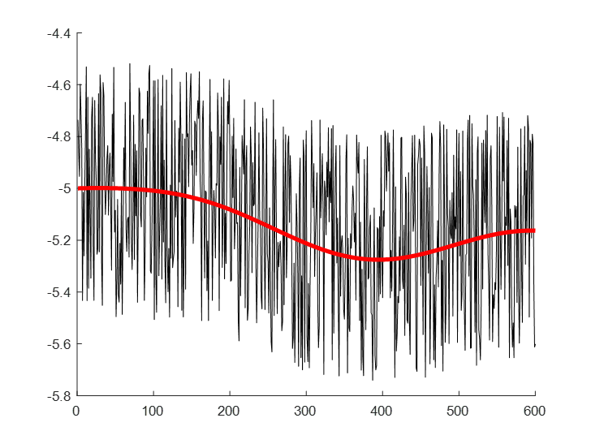

## 湍流
为了描述边界层中大气的运动，我们需要知道一些用于解析边界层的物理概念与方法。

先看一组真实世界中的气温-时间序列：

如果不看红线，只会感觉密密麻麻的，似乎没什么特别。但是加上这条红线，就可以看出点端倪：我们测得的物理量都在这个红线附近波动，而红线本身又呈现波的形状。

也就是说，真实世界中，流体的流动形式有以下三种：
平均运动 $\bar A$，波动 $A'$和湍流运动$A''$ 。也就是说，任何一个变量都能写成 $A=\bar A+A'+A''$ ！换种方法说，流体运动是平均运动、波动和湍流三者的叠加。

这和[动力气象学中的波动](./wave.md)类似，只不过动力气象学中研究的是自由大气，所以可以忽略湍流的作用。

但是，我们讲了半天，到底什么是**湍流 (turbulence)**呢？

### 什么是湍流

一般提起流体，我们很容易想到水流，比如水喉流出的水。一般来说，如果流量很小的话，水流呈现出比较稳定的结构

在这些情况下，流体质点彼此互不混杂，质点运动轨迹呈平滑直线的流动。我们称这样的运动为**层流 (laminar)**。

但是，如果一下把出水量跳到最大，那么水流就不再是像图上这样流动了，而是喷涌而出。

这种喷涌而出的水流就被称为**湍流 (turbulence)**。

但是说来惭愧，目前湍流仍然没有一个准确的定义，只有以下几种主流的定性描述：
1. Von.Karman和I.G Taylor对湍流的定义：湍流是流体和气体中出现的一种无规则流动现象。
2. Hinze对湍流的定义为：只提不规则运动不全面，“湍流的各个量在时间和空间上表现出随机性。
3. 周培源：湍流为一种不规则的涡旋(eddy)运动。

为了规范，我们不妨采取Hinze与Taylor说法的叠加：湍流是流体和气体中出现的一种无规则流动现象，并且湍流的各个量在时间和空间上表现出随机性。也就是说，我们看到水枪喷射出来，飞溅的水、工厂排出乱飘的烟都是湍流。

综上，湍流与层流的区别如图所示

实际上，湍流大量存在于我们生活之中。如果你感兴趣，可以看看这个[视频](https://www.youtube.com/watch?v=RkewD966Y90)。

### 湍流的研究方法
现在我们知道了湍流的产生机制，接下来就要开始正式研究湍流了。

#### 泰勒假设
首先，我们应该获取湍流的资料。但是，由于流体在无时无刻的运动，湍涡也在不停的生消发展，我们该怎么测量一个无时无刻在变化的量呢？在1938年，泰勒（I.G Tylor）提出：**在特定条件下，湍流平移经过传感器时，可以将它看成凝固的。** 即，如果 $\frac{d\xi}{dt} = 0$ ，则有

$$
\frac{d\xi}{dt} = \frac{\partial \xi}{\partial t} + U \frac{\partial \xi}{\partial x} + V \frac{\partial \xi}{\partial y} + W \frac{\partial \xi}{\partial z}
$$

也就是

$$
\frac{\partial \xi}{\partial t} = - U \frac{\partial \xi}{\partial x} - V \frac{\partial \xi}{\partial y} - W \frac{\partial \xi}{\partial z}
$$

这样，区域内物理量随时间的变化就可以通过泰勒假设间接地通过排除时间变量求得。而根据 $\frac{d\xi}{dt} = 0$ ，可知其适用于湍强不太大、风速不太小、均匀湍流、平稳湍流的地区。也就是说，这个方法只能用于获取稳态流动中的湍流信息。

#### 湍流方程
现在我们算是解决了资料的问题了。接下来，我们需要做另一件事：解方程。

我们知道，大气科学，乃至流体力学，都在试图解决一个核心的问题：Navier-Stokes方程（NS方程）

$$
\rho \left( \frac{\partial \mathbf{u}}{\partial t} + (\mathbf{u} \cdot \nabla)\mathbf{u} \right) = -\nabla p + \mu \nabla^2 \mathbf{u} + \mathbf{f}
$$ 

或者写成大气科学领域更为熟悉的方式

$$
\frac{d\vec{V}_h}{dt} = -f \vec{k} \times \vec{V} - \frac{1}{\rho} \nabla P
$$

但是，众所周知，这是一个极其难以求解的，高度非线性的方程，我们必须使用一些技巧来辅助我们求解。在计算流体力学（Computational Fluid Dynamics, CFD）中有两个常用的方法：雷诺平均方法（Reynolds-Averaged Navier-Stokes, RANS）和大涡模拟方法（Large Eddy Simulation, LES）。

我们先介绍更为常见[RANS方法](./RANS.md)，接下来的讲解也将围绕着RANS进行。如果后续有需要的话，我再更新[LES方法](./LES.md)。

#### 湍流闭合与参数化
经过上述的过程，我们得到了雷诺平均后的控制方程组如下：

### 湍流的产生机制
雷诺（Reynold）在1883年做了一个[实验](https://www.youtube.com/watch?v=y0WRJtXvpSo)（不能播放的话可以看看这个[比较长的版本](https://www.bilibili.com/video/BV14U4y1f7K7)）验证管道中湍流的产生机制。

他发现流体呈现湍流还是层流运动主要取决于：
1. 流体流速
2. 管子直径
3. 液体性质

根据这个性质，他得出了雷诺数（Reynolds number）：

$$
\text{Re}=\frac{\rho U L}{\mu}=\frac{U L}{\nu}
$$

其中 $\nu=\frac{\mu}{\rho}$ ，表示运动粘度。
关于这个式子具体的介绍，我会放在[基础知识](./basis.markdown#雷诺数)章节中（如果我想得起来更的话XD）

通过计算雷诺数，我们可以得到湍流的运动类型式层流还是湍流。当雷诺数大于临界雷诺数 $Re_c$ 时，流体从层流转变。

不过，雷诺数只是一个用于鉴别流体运动类型的工具，不能反映湍流的产生机制。一般来说，在大气中，湍流主要有两个产生机制：对流热泡和速度梯度。我们从[湍流动能方程](./RANS.md#湍流动能方程)中可以看出一点端倪。

#### 对流热泡
根据之前对于湍流的示意图，湍流的组织形式可以看作一个个小的涡旋 (专业称呼为湍涡，eddy)。你可以利用湍涡对湍流加深理解：**湍流可以看成叠加上许多湍涡的平流运动流体**。

当地面受到太阳辐射加热后，某些受到辐射量比较大的地面温度就会高于周围。热量传导到大气中，就产生了局地的高温热泡。如图所示

当热泡上升脱离地面后（详细的描述可以参考[这篇文章的 “2、成因” 部分](https://daily.zhihu.com/story/8113698)），会因为失去能量源而破碎。破碎的热泡就像浴缸中的泡泡一样变成更小的泡泡，这些小泡泡就是湍涡。

#### 剪切作用
第二种情况是风的剪切作用。当风吹过地表，受到地表的阻曳作用，靠近地表的风速会小于远离地表的风速。

这种风的垂直切变会让气团旋转，产生涡旋。比如图中右边这个风速切变就会产生顺时针的涡旋。这些涡旋也会破碎产生小的湍涡。

### 湍流稳定度

### 湍流的发展

### 湍流的性质

## 参考书目
[princeton mae 553](http://profs.sci.univr.it/~zuccher/downloads/FD-MAE553-Smits.pdf)