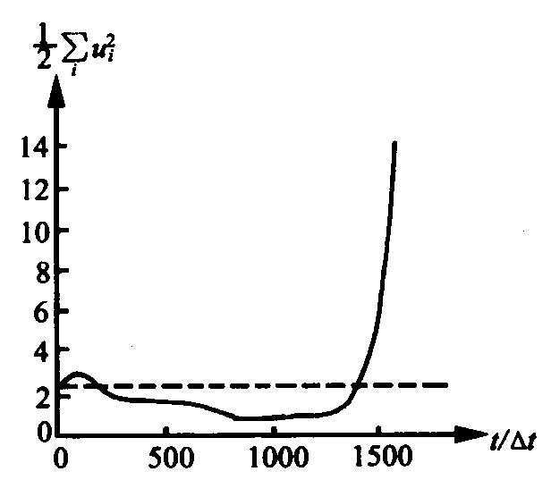

## 抽象
本文章将带大家建立一个最基本的数值程式，希望大家能在一边学习的过程中一边实操，以加深数值预报的理解。本文的理论推导部分参考了部分[陈志强同学](https://space.bilibili.com/508321627?spm_id_from=333.337.0.0)的推导，如果感兴趣的话可以去支持一下他。

## 预备知识
在开始搭建自己的数值预报程序前，你需要知道这些前置内容
1. 流体力学的基本思想
2. 大气运动基本方程组和每一项的意义
3. 一些Fortran编程的基础知识

如果你都会了的话，那我们就开始吧！
## 大气运动方程组
为了防止你忘记，或者你所认识的大气运动方程组和我接下来要介绍的有些不同，在这里向你提供我接下来要用到的方程组们
### 水平动量方程 
\[ \frac{d\vec{V}_h}{dt} = -f \vec{k} \times \vec{V} - \frac{1}{\rho} \nabla P \]
为了方便网格化，所有方程都需要进行展开。但我这里偷一下懒，先不展开。
### 静力平衡
\[ \frac{\partial P}{\partial z} = -\rho g \]

### 连续方程
\[ \frac{\partial \rho}{\partial t} = -\nabla \cdot (\rho \vec{V}) \]

### 状态方程
\[ P = \rho R T \]

### 能量方程
\[ \frac{d\theta}{dt} = \frac{\theta}{c_P T} \frac{dQ}{dt} \]
其中位温theta的定义为
\[ \theta = T \left( \frac{P_0}{P} \right)^k \]

## 垂直坐标（z）
我们知道，按照笛卡尔坐标系，可以描述物体在水平与垂直方向的运动。但是，如果使用笛卡尔坐标，就必须要涉及密度项。我们在实际观测中很难测定大气的具体密度，所以，笛卡尔并不能让我们很方便的描述大气的运动。为此，我们需要新的能把密度踢出去的垂直坐标系。
### 一般的s坐标系
我们先假设一个通用的垂直坐标参数s，用以推导后续特殊的坐标参数。
首先，这个s必须满足以下性质：

1. 随高度单调递增或递减
2. 与高度值一一对应
3. 
这两个性质保证了坐标的稳定性，不会出现一个s高度对应两个z高度的窘境，也方便我们直观感受s坐标下的高度大小。

有了这么一个变量，接下来，我们要替换基本方程组中所有与z有关的变量，让所有的z变成s。即
\[z=(x, y)_z=z(x, y, s)_s\]

接下来将用水平动量方程的梯度力项示范怎么进行转换。

\[\frac{1}{\rho} \nabla P\]
其中，P是z的函数，需要对他变换。
\[P=P(x, y, z)_z=P(x, y, z(x, y, s))_z=P(x, y, s)_s\]
两边同时求梯度，得
\[\nabla P_z+\frac{\partial P}{\partial z}\nabla z_s=\nabla P_s\]
考虑到第二项中间出现静力平衡方程的左半部分，为了消去密度，带入静力方程
\[\nabla P_s=\nabla P_z + -\rho g\nabla z_s=\nabla P_z -\rho \nabla\Phi_s\]
其中Phi为位势。
依照这个步骤，可以将其余项转换为s坐标系，得到以下方程

#### 动量方程
\[ 
\frac{\partial \vec{V}_h}{\partial t} + (\vec{V}_h \cdot \nabla_s)\vec{V}_h + \omega \frac{\partial \vec{V}_h}{\partial s} = -f \vec{k} \times \vec{V}_h - RT \nabla_s (\ln P) - \nabla_s \Phi 
\]

#### 静力平衡方程
\[ 
\frac{\partial \Phi}{\partial (\ln P)} = -RT 
\]

#### 连续方程
\[ 
\frac{\partial}{\partial t} \left( \frac{\partial P}{\partial s} \right) = -\nabla_s \left( \vec{V}_h \frac{\partial P}{\partial s} \right) - \frac{\partial}{\partial s} \left( \omega \frac{\partial P}{\partial s} \right) 
\]

#### 能量方程
\[ 
\frac{\partial \theta}{\partial t} + \vec{V}_h \cdot \nabla_s \theta + \omega \frac{\partial \theta}{\partial s} = \frac{\theta}{c_P T} \frac{dQ}{dt} 
\]

在代换的过程中，状态方程用于替换密度rho而融入了静力方程和动量方程。我们通过引入位势变量成功消除了密度。接下来，我们可以利用这个一般性变量s推广至各个特殊性高度变量。
### P坐标系
由于我们目前的高空资料主要来源于探空气球，他们只能在等气压面上保持静止。因此，我们可以尝试用P来替换z。

对于动量方程
\[ 
\frac{\partial \vec{V}_h}{\partial t} + (\vec{V}_h \cdot \nabla_s)\vec{V}_h + \omega \frac{\partial \vec{V}_h}{\partial s} = -f \vec{k} \times \vec{V}_h - RT \nabla_s (\ln P) - \nabla_s \Phi 
\]

由于在同一气压层上，气压梯度为0，所以改写后的方程为
\[ 
\frac{\partial \vec{V}_h}{\partial t} + (\vec{V}_h \cdot \nabla_P)\vec{V}_h + \omega_P \frac{\partial \vec{V}_h}{\partial P} = -f \vec{k} \times \vec{V}_h  - \nabla_P \Phi 
\]
对于连续方程
\[ 
\frac{\partial}{\partial t} \left( \frac{\partial P}{\partial s} \right) = -\nabla_s \left( \vec{V}_h \frac{\partial P}{\partial s} \right) - \frac{\partial}{\partial s} \left( \omega \frac{\partial P}{\partial s} \right) 
\]
由于
\[\frac{\partial P}{\partial P}=1\]
所以连续方程改写为\[ 
\nabla_s \left( \vec{V}_h\right) = -\frac{\partial\omega_P}{\partial P}
\]
综上，方程组改写为
#### 动量方程
\[ 
\frac{\partial \vec{V}_h}{\partial t} + (\vec{V}_h \cdot \nabla_P)\vec{V}_h + \omega_P \frac{\partial \vec{V}_h}{\partial P} = -f \vec{k} \times \vec{V}_h  - \nabla_P \Phi 
\]

#### 静力平衡方程
\[ 
\frac{\partial \Phi}{\partial (\ln P)} = -RT 
\]

#### 连续方程
\[ 
\nabla_s \left( \vec{V}_h\right) = -\frac{\partial\omega_P}{\partial P}
\]

#### 能量方程
\[ 
\frac{\partial \theta}{\partial t} + \vec{V}_h \cdot \nabla_p \theta + \omega \frac{\partial \theta}{\partial p} = \frac{\theta}{c_p T} \frac{dQ}{dt} 
\]

### sigma坐标系
现在我们有了一个很方便的坐标系，只不过现在将其用作数值预报还有一点小问题：下边界的确定。

我们可以假设大气的上边界气压为0，垂直速度为0，象征真空。但是下边界就不不能简单的一概而论。在下边界，受到地形的影响，p坐标系的边界会显得破碎。这使我们难以确定数值预报中十分重要的边界条件。

为了使P坐标系更合适描述下边界，需要引入sigma作为新的高度变量，其中sigma描述为到大气层顶的气压差与大气总气压差之比，大小在0（层顶）到1（层底）。

\[\sigma=\frac{P-P_{top}}{P_0-P_{top}}\]

sigma的引入使P坐标不再受到地形的影响，可以看作一个特殊（地形跟随）的气压坐标。
可以变形sigma坐标系的定义式得到

\[P=\sigma(P_0-P_{top})+P_{top}\]

利用上式，以P坐标系的推导方式，可以推出sigma坐标系下的基本方程组
#### 动量方程
\[ 
\frac{\partial \vec{V}_h}{\partial t} + (\vec{V}_h \cdot \nabla_\sigma)\vec{V}_h + \omega_\sigma \frac{\partial \vec{V}_h}{\partial \sigma} = -f \vec{k} \times \vec{V}_h - RT \nabla_\sigma (\ln P) - \nabla_s \Phi 
\]


#### 静力平衡方程
\[ 
\frac{\partial \Phi}{\partial (\ln P_0)} = -RT 
\]

#### 连续方程
\[ 
\frac{\partial P_0}{\partial t} = -\nabla_\sigma (\vec{V}_hP_0)- \frac{\partial}{\partial \sigma} \left( \omega_\sigma P_0 \right) 
\]

#### 能量方程
\[ 
\frac{\partial \theta}{\partial t} + \vec{V}_h \cdot \nabla_p \theta + \omega \frac{\partial \theta}{\partial p} = \frac{\theta}{c_p T} \frac{dQ}{dt} 
\]

虽然sigma坐标有跟随地形、上下边界简单的优点，但在地形陡峭的地方

\[RT \nabla_\sigma (\ln P) - \nabla_s \Phi\]
中Phi和lnP都很大，相减时会产生很大的误差。

## 水平坐标（x, y）
由于地球是个球体，如果使用直角坐标系描述全球大气运动，方程组将会变得十分复杂。如果引入一些特殊的坐标系，有助于减小方程的复杂程度。（尽管直角坐标系在局地还是相当好用）

### 正交曲面坐标系
我们常用的直角坐标系是由三个互相垂直（正交）的平面所组成的。那如果组成坐标的不是平面而是曲面呢？

让我们假设有三个曲面，你可以任意摆放他们，直到他们三个相交，产生一个弯曲的墙角。你现在可以在脑海中调整三个曲面的位置，直到在很小的地方，这三个曲面可以看成平面，让我们把他们摆成直角坐标系中X、Y、Z面那样。

观察此时三个面交成的三条曲线，现在你就有了一个正交曲面坐标系！

但是，这个随意的坐标系似乎并不能帮我们解决问题。我们需要将其与直角坐标系形成映射。

考虑正交曲面坐标系中任意一条曲线\[q\]，取其很小的一段变化，小到可以将曲线看成直线。你应该猜得到我们接下来要做什么了：把曲线微分成直线！此处以x轴方向为例：

这个时候，我们的问题就和高中导数题一样：“求导”。

对于矢径r的变化，可以类比于函数的y值，和曲线实际的变化，有
\[\Delta r = H\Delta q\vec{e}\]

其中e为q的方向向量，H为增量，有个更专业的名字：拉密系数。

以此类推，可以求出三个方向的式子，在一起表示为
\[\frac{\partial r}{\partial q_j}=H_j\vec{e_j}; j=1,2, 3\]
综上，可以将任意矢径表述为
\[\frac{\partial r}{\partial q_j} = \frac{\partial x}{\partial q_j}\vec{x} + \frac{\partial y}{\partial q_j}\vec{y} + \frac{\partial z}{\partial q_j}\vec{z}\]
通过拉密系数，我们可以计算矢量。

对于直角坐标系向正交曲面坐标系转换的过程，有\[d l=Hd q\]
只要通过这个关系换算，就可以得到梯度和旋度的换算关系。我接下来会给出梯度的计算方式作为例子，但我希望你自己算一下加深印象。
\[\nabla = (\frac{\partial }{\partial x}, \frac{\partial }{\partial y}, \frac{\partial }{\partial z})_{直角坐标系}=(\frac{\partial }{\partial Hq_1}, \frac{\partial }{\partial Hq_2}, \frac{\partial }{\partial Hq_3})_{正交曲面坐标系}\]

这样我们就能求出来正交曲面坐标系的基本方程组
#### 动量方程
\[ 

\]

#### 静力平衡方程
\[ 

\]

#### 连续方程
\[ 

\]

#### 能量方程
\[ 

\]


### 球坐标系
根据正交曲面坐标系，可以很轻松的描述球坐标系：

在x方向，球坐标系的路径为圆形，圆的半径为\[r \cos\phi\]，一小段距离的位移为\[r\cos\phi\Delta\lambda\]，与\[\Delta x\]相比，得拉密系数\[H=r\cos\phi\]

以此类推，球坐标的三个拉密系数分别为

x轴\[H=r\cos\phi\]
y轴\[H=r\]
z轴\[H=1\]


## 地图投影
我们通常采用网格作为预测模式。如果要使用网格，我们得选取一个“地图”作为我们网格施展的基础。然而，由于地球是圆的，难以完美的投影到平面上，总会产生各种各样的误差。因此，产生了各种投影方法；同时，选用不同的投影方式，可以从某些方面尽可能的还原地球的一些性质。比如能让地图上两个任意直线的夹角保持不变的投影方式被称为**正形投影**。接下来我将向大家随便介绍几种常用的投影方法。
### 比例尺
地图可以看作是把地球上的每一个点依据固定的规则映射到纸面上，我们将这个纸面称为映像面。注意，这个面不一定是平面，也可以是其他形状的面。这个纸面还不是我们所称的地图，只有当我们确定了纸面的放大（其实一般是缩小）大小（地图比例尺/缩小比例尺）后，才将这张纸称为地图。而还没放大时纸面上的距离与地球相应位置距离的比例为映像比例尺（实际比例尺）。

我们希望地图尽量准确反映地球，起码也得在一定区域能准确反映。因此，我们希望映像比例尺最好是1，而且是1的地方越多越好。

现在我们来认识三种投影方式，分别用于高中低纬度。
### 极射赤面投影

一般我们选定北纬60度，用一张纸（地图）切开地球，然后从对向极心（南极）做射线，连接地球表面和纸。极射赤面投影可以画出整个地球的地图，在60°N最为准确。

由图，可以看出来，在极地区域其实畸变都不是很大，但是越往赤道走，地图上的形变就越大，所以极射赤面投影投影只适合在高纬度使用。

### 兰伯特投影


如图，兰伯特投影是把一张纸卷成圆锥的形状，在30°N和60°N处与地球相割。然后从地球球心做射线，将射线连接的地图上的点与纸上的点做一一对应。

也就是说，在兰伯特投影的情况下，30°N和60°N所夹的区域都能较为精确的还原，兰伯特投影适合中纬度。

### 墨卡托投影

这种投影把纸卷成一个圆柱，用圆柱去割地球的南北纬22.5度。像兰伯特投影一样，墨卡托投影也是从球心射出直线进行映射。看图也能看出来，这种投影方式在赤道附近的还原程度远好于两级。

### 放大系数与地转参数

在这么多投影方式中，我们可以根据任务的需要，制定一个合适的投影方法。在先前的介绍中，你是否会有疑问：为什么网格化地球需要投影？这是因为在我们的动量方程中的地转参数f随纬度发生变化，我们需要在构建初始场的时候，把地转参数先确定出来。

总结，我们的目的是利用\[f=2\Omega\sin\phi\]根据网格坐标与纬度的关系求解出网格上的f。

我们根据一些简单的圆锥曲线知识，可以将上述三种投影方法的投影面看作为圆锥，只不过这些圆锥有点怪：高度可能是0或者无穷。

可以想象，投影的是一个圆锥状光线。对于圆锥状的光线，有圆锥常数\[k=\frac{\alpha}{2\pi}\]
其中alpha为圆锥展开成扇面后张成的角度。
对于纬度和横向距离的关系\[m_{横}=\frac{L_{map}}{L_{earth}}\]
对于地球上的长度，有\[L_{earth}=2\pi a\cos\phi\]其中a为地球半径，phi为纬度

对于地图上的长度，有\[L_{map}=2\pi l k\]其中l为圆锥的斜边长

则\[m=\frac{lk}{\alpha\cos\phi}\]
对于标准纬度（对于极射赤面投影为60°N），此时m=1，有\[k=\frac{\alpha\sin\theta_0}{l_0}\]（theta余纬为90°减phi），对于给定的theta和长度l，就能确定k。

可以证明上述三种投影都是为正形投影（m=l），但证明过程这里写不下。也就是说\[m_{竖}=\frac{d l}{a d \theta}=m_{横}=\frac{kl}{a\sin\theta}\]
做个简单的变化，两边积分，可得到\[l|^{l}_{l_0}=(\tan\frac{\theta}{2})^k|^\theta_{\theta_0}\]
可推出\[l=\frac{a\sin\theta_0}{k}(\frac{\tan\frac{\theta}{2}}{\tan\frac{\theta}{2}})^k\]
与\[m=\frac{kl}{a\sin\theta}=\frac{\sin\theta_0}{\sin\theta}(\frac{\tan\frac{\theta}{2}}{\tan\frac{\theta}{2}})^k\]

对于极射赤面投影投影，theta_0的值为90-60=30；对于兰伯特投影，由于有两个标准纬度，可以随意代入任意一个；对于墨卡托投影，可以可以直接用纬度快速计算，得\[m=\frac{L_real}{L_map}=\frac{2\pi a\cos\phi}{2\pi a\cos22.5}\]

#### 实用方法
由于实际上网格的纬度求解起来比较复杂，所以一般不使用上述的方法直接求解，而是还要采用一些小技巧来代替纬度以节省性能。由于在计算机中，网格都是用array存储，通过坐标索引，我们来尝试使用网格点坐标来替换纬度。

由于我想带大家写一个兰伯特投影的预报程序，我们接下来直接推导兰伯特投影的形式。对于l和m，可以使用\[\tan\frac{\theta}2=\frac{\sin\theta}{1+\cos\theta}=\frac{\cos\theta}{1+\sin\theta}\]
替换正切，得到
\[l=\frac{a\sin\theta_0}{k}(\frac{\tan\frac{\theta}{2}}{\tan\frac{\theta}{2}})^k=\frac{(2+\sqrt3)a}{2}\frac{\cos\phi}{1+\sin\phi}\]
与\[m=\frac{kl}{a\sin\theta}=\frac{\sin\theta_0}{\sin\theta}(\frac{\tan\frac{\theta}{2}}{\tan\frac{\theta}{2}})^k=\frac{(2+\sqrt3)}{2}\frac{1}{1+\sin\phi}\]
现在未知的参数是k，但我们有两个theta_0（30°N和60°N），所以我们分别带入这两个theta_0求解，可以得到
\[k=\frac{\ln\sin\theta_1-\ln\sin\theta_2}{\ln\tan\frac{\theta_1}2-\ln\tan\frac{\theta_2}2}\approx0.7156\]
引入投影映像面中心点到北极的距离
\[l_e=\frac{(2+\sqrt3)a}{2}=\frac{a\sin\theta_1}{k}(\frac1{\tan\frac{\theta_1}{2}})^k\approx11423.37km\]
则sin\phi可以写成\[\sin\phi=\frac{l_e^{2/k}-l^{2/k}}{l_e^{2/k}+l^{2/k}}\]
对于m有
\[m=\frac{kl}{a\sqrt{1-(\frac{l_e^{2/k}-l^{2/k}}{l_e^{2/k}+l^{2/k}})^2}}\]
同时，地转参数也可以表示出来了
\[f=2\Omega\frac{l_e^{2/k}-l^{2/k}}{l_e^{2/k}+l^{2/k}}\]
其中，l表示网格点到北极点的距离
\[l=\sqrt{I_n^2+J_n^2}d\]

这样我们就完全排除了phi，只要求出网格点相对于北极点的坐标I_n和J_n就能求解了。

参考这张图，定义地图上横纵坐标的极限为M，N；任一点（i，j）。计算横坐标，地图坐标系原点在网格上表示为（M-1）/2；所以任意一点的I_n为\[I_n=i-\frac{M-1}{2}\]
对于纵坐标，地图坐标系原点到网格原点的距离为l，格点的格距为d，则\[J_n=\frac{l-id}{d}\]
#### 编程！
```fortran
subroutine ComputeMapFactors(m, f, d, centerLat, M, N)
    ! 如无特殊标注，本代码内的变量名按照前文推导中的命名
    ! centerLat 为中心点纬度
    implicit None
    integer, intent(in) :: M, N
    real, intent(in) :: d, centerLat
    integer :: i, j
    real :: k = 0.7156
    real :: l_e = 11423370.0
    real :: a=6371000.0
    real :: Omega = 7.292e-5
    real :: lall    ! 地图最南端到北极点的距离
    real :: lHalf   ! 地图中心到地图最南端的距离
    real :: l       ! 纬度phi处点到北极的距离
    real :: I_n, J_n
    real :: sinphi
    real, dimension m(M, N), f(M, N)
    
    lHalf = d * (N - 1) / 2
    lall = l_e + lHalf
    do i=1, M
        I_n = i - (M - 1) / 2
        do j=1, N
            J_n = (lall - j * d) / d
            l = sqrt(I_n**2 + J_n**2) * d
            sinphi = (l_e**2 - l**2)/(l_e**2 + l**2)
            f(i, j) = 2*Omega*sinphi
            m(i, j) = k*l/(a*sqrt(1-sinphi**2))
        end do
    end do
end subroutine ComputeMapFactors 
```

## 数值差分

现在，我们的所有基本工作都做好了，让我们捡起fortran，正式编写一个自己的程序吧！

首先，我们必须知道，在计算机是没有办法直接求解微分方程的。我们首先要做的是将现实中连续的物理量离散化。我们可以像切芒果一样，使用网格将空间切成一个个规则的立方体，这一过程叫做有限差分。当然，不但在空间上要这样处理，时间上也要进行一样的操作。


我们把网格两个边的距离称为格距，格距越小代表着空间分辨率越高；时间上的间隔称为时间步长，时间步长越小时间分辨率越高。为了方便表示，我们把每个网格都进行编号。

```fortran
! 一个表示二维空间网格的fortran程序
real :: example(i, j)
```

为了简便表示，需要先定义这些表示方法：

\[x_i=i\Delta x\]

\[t^n=n\Delta t\]

\[u^n_{i, j}=u(i\Delta x, j\Delta y, n\Delta t)\]

在离散化之后，原本连续的函数f将会变成离散的f
\[f(x)=f(i); i=range(n)\]

对于函数的变化\[\frac{\partial f}{\partial x}\]

可以用泰勒展开表示\[f(x+\Delta x)=f(x)+\frac{\partial f}{\partial x}\frac{\Delta x}{1!}+\frac{\partial^2 f}{\partial x^2}\frac{(\Delta x)^2}{2!}+...\]

移项，可得
\[\frac{\partial f}{\partial x}=\frac{f(x+\Delta x)-f(x)}{\Delta x}-\frac{\partial^2 f}{\partial x^2}\frac{(\Delta x)^2}{2!}-...=\frac{f(x+\Delta x)-f(x)}{\Delta x}+R\]

R表示截断误差，R的量级为\[O(\Delta x)\]

这种表示函数变化的方式被称为前向差分，简称为前插，在i处的前插可以表示为：
\[(\frac{\partial f}{\partial x})_i=\frac{f_{i+1}-f_i}{\Delta x}+R\]

同理，可以构造出后向差分（后插）
\[(\frac{\partial f}{\partial x})_i=\frac{f_{i}-f_{i-1}}{\Delta x}+R\]

和中央差分（中央差）
\[(\frac{\partial f}{\partial x})_i=\frac{f_{i+1}-f_{i-1}}{2\Delta x}+R\]

其中，中央差的误差是\[O(\Delta x^2)\]

想必你已经猜到了，一阶导数有对应的差分形式，二阶导数也会有对应的差分形式。这可以理所应当的推广到n阶。

比如说，对于二阶差分，前插格式为
\[(\frac{\partial^2 f}{\partial x^2})_i=\frac{\frac{f_{i+2}-f_{i+1}}{\Delta x}-\frac{f_{i+1}-f_i}{\Delta x}}{\Delta x}+R==\frac{f_{i+2}-f_i}{\Delta x^2}+R\]

接下来我们就能顺利地用差分格式替代微分格式进行数值预报了

吗？

请不要忘记我们的R。由于我们每一次差分，计算解都会产生一次误差。如果这个误差不能保持在一个合理的范围内，那我们的差分计算就会随着运算次数的增多而不再能反映微分方程原本的解，计算便失去了意义。

我们可以形象的理解这一过程：

我用相机照相，真实世界中的景物是连续的，但从相机的显示器中看到的其实是一个个像素点。如果我对着相机的显示器继续照相，再看到的画面就和真实画面有一些差别。要是我不断重复这一过程，最终画面只会完全看不出最初的景色。

为了解决这一问题，我们需要差分方案符合三个性质：

1. 相容性。相容性指的是当分辨率足够高（格距或步长趋于0）时，拍照得到的画面和真实画面完全一致（差分方程无限接近微分方程）；
2. 收敛性：每一次拍照画面的误差（每一次积分积累的误差R）能不能在分辨率足够高（格距或步长趋于0）的情况下趋向于0；
3. 稳定性：由于在计算机中浮点数都受到精度的限制，不能完全等于真实的数值，如果每一次差分这些失真都能在时间、空间分辨率趋于0时保持稳定，该差分格式就具有稳定性。

但是，我们基本上没有办法得到准确的R的——没人知道差分方程的真解到底是多少。好在拉克斯的研究证明：对于适定的线性偏微分方程组初值问题，一个与之相容的线性差分格式收敛的充分必要条件是该格式是稳定的。用人话说就是只要差分方程满足相容性和稳定性，这个差分格式就是可用的。

现在，告诉你一个好消息！我们的方程都是相容的，你基本上找不到根据上述方法处理后还不相容的方程。也就是说，我们接下来的工作重心只要放在考察方程是否稳定就好了。

### 线性计算稳定性

由于现实中的各个物理量都在一个固定的范围内浮动，比如气温最高也不会超过一百度（日本除外）。但对于数值计算来说，随着时间的增加，如果物理量一直增加，那显然就不能很好的反映现实情况了。

由于我们只需要考虑差分格式的稳定性，选取什么样的方程都无所谓。为了计算简单，我们选取一维线性平流方程来计算稳定性。
\[\frac{\partial u}{\partial t} + c\frac{\partial u}{\partial x} = 0\]

由于时间必须向前积分才有意义，时间必须使用前插或中央差。我们现在先讨论时间使用前插的情况。

我将以后插的空间格式推导如何计算线性稳定性。虽然我会告诉你空间格式为中央差的稳定性，但还是请你尝试计算。（空间格式后插的话由于是相反与平流方向更新，因此不可能存在变化，没有讨论的必要）

### 空间差分格式

由于时间必须向前积分才有意义，时间必须使用前插或中央差。我们现在先讨论时间使用前插的情况。

我将以后插的空间格式推导如何计算线性稳定性。虽然我会告诉你空间格式为中央差的稳定性，但还是请你尝试计算。（空间格式后插的话由于是相反与平流方向更新，因此不可能存在变化，没有讨论的必要）

#### 计算方式

我们展开平流方程，得到
\[\frac{u^{n+1}_{i}-u^n_{i}}{\Delta t}+c\frac{u^n_{i}-u^n_{i-1}}{\Delta x}=0\]

移项，引入参数\[\beta=c\frac{\Delta t}{\Delta x}\]

得到
\[u^{n+1}_{i}=u^n_i-\beta(u^n_{n}-u^n_{i-1})\]

由于大气具有波动性质，可以用波的指数表示
\[A\sin(kx-\omega t+\phi)=Ae^{I(kx-\omega t+\phi)}\]

将大气中的物理量表示为
\[u(x, t)=Ae^{Ik(x-ct)}=Ae^{Ikx}\cdot e^{Ikct}\]

可以将波分为振幅随时间的变化\[A^n=e^{Ikct}\]和波动在空间上的分布\[e^{Ikx}\]

则平流方程写成
\[A^{n+1}e^{Ikxi}=(1-\beta)A^{n}e^{Iki\Delta x}+\beta A^{n}e^{Ik(i-1)\Delta x}\]

引入增幅因子\[G=\frac{A^n}{A^{n-1}}=\cdots=\frac{A^2}{A^{1}}\]

平流方程写成
\[G=(1-\beta)+\beta e^{-Ik\Delta x}\]

应用欧拉公式\[e^{Ix}=\cos x+I\sin x; e^{-Ix}=\cos x-I\sin x\]

平流方程写成
\[G=1-\beta+\beta(\cos \Delta x-I\sin \Delta x)\]

只要增幅因子G≤1，差分格式就能保证稳定了。

为了去除虚数I，取模
\[|G|^2=(1-\beta+\beta\cos \Delta x)^2+(\beta I\sin \Delta x)^2=1-4\beta(1-\beta)sin^2\frac{k\Delta x}{2}\leq1\]

当\beta属于0到1时，增幅因子小于等于1。因为G≤1需要满足条件，称为条件稳定。

\[\beta=c\frac{\Delta t}{\Delta x}\leq1\]被称为CFL稳定性，表示对于固定的网格距，时间步长与波动成正比。

可以总结操作的步骤为
1. 写出差分格式的波动形式
2. 求出增幅因子
3. 分析G≤1的情况
4. 讨论稳定性

#### 前插格式的特点

由于在中纬度总是有盛行西风，根据建系规则，前插格式在中纬度其实是对着盛行风方向。所以前插格式在中纬度也被称为**迎风格式**（注意：只要差分方向与盛行风向一致就是迎风格式，所以迎风格式≠欧拉格式）

迎风格式有以下特点：
1. 条件稳定，如果减小时间或空间分辨率，另一分辨率也要相应减小
2. 增幅因子≤1，振幅不断减小，能量耗散

#### 中央差格式

对于\[\frac{u^{n+1}_{i}-u^n_{i}}{\Delta t}+c\frac{u^n_{i+1}-u^n_{i-1}}{2\Delta x}=0\]

计算得到\[|G|^2=(1-I\beta\sin k\Delta x)^2=1+\beta^2\sin^2k\Delta x\geq1\]

中央差格式又称**欧拉格式**，根据上述讨论，中央差格式不论beta取什么都会有G≥1，绝对不稳定，不能采用。

### 时间差分格式

我们之前的差分格式中，对于\[\frac{\partial u}{\partial x}\]展开的时间层都是n，也就是当下时刻。如果我的时间层不局限于n，选取n-1或者n+1，又会发生什么呢？

#### 隐式格式

我们现在考虑时间层选取未来时刻的情况。由于未来的时刻我们不能直接求解，需要额外的方程。于是我们称所有计算过程涉及未来时间层的格式为**隐式格式**。

##### 梯形隐式格式

我们现在改变思路，如果不使用n时刻的时间层计算未来的情况，会怎么样？我们可以构造n+1/2时间层的情况。

假设我知道了n+1时间的物理量，那我可以对n+1和n时刻两层取均值计算n+1/2时刻。也就是说\[\frac{\partial u}{\partial x}=\frac{\frac{u^{n+1}_{i+1}-u^{n+1}_{i-1}}{2\Delta x}+\frac{u^n_{i+1}-u^n_{i-1}}{2\Delta x}}{2}\]

此时，格式为\[\frac{u^{n+1}_{i}-u^n_{i}}{\Delta t}+c\frac{\partial u}{\partial x}=\frac{\frac{u^{n+1}_{i+1}-u^{n+1}_{i-1}}{2\Delta x}+\frac{u^n_{i+1}-u^n_{i-1}}{2\Delta x}}{2}=0\]

由于计算过程很复杂，我就不计算了，详细的过程可以参考[这个视频](https://www.bilibili.com/video/BV1La411s7CE)。不过，可以告诉你，这个格式的G恒为1。所以这个格式中性稳定，且振幅不会衰减。但是他也有很大的缺点，就是计算复杂，在设计时需要考虑性能开销。

##### 欧拉-后插格式

TBC

##### 

#### 蛙跃格式

当然，时间层除了考虑未来的情况，也可以考虑过去的情况。

现在，我们来考察时间空间都使用中央差的格式。这种格式一共用到\[f^{n+1}_{i}; f^{n}_{i-1}; f^{n}_{i-1}; f^{n-1}_{i}\]四个点，计算时就像青蛙在荷叶上蹦跳一样从n-1跳到n再跳到n+1，于是称为蛙跳格式。

让我们写出一维平流方程的差分形式
\[\frac{u^{n+1}_{i}-u^{n-1}_{i}}{2\Delta t}+c\frac{u^n_{i+1}-u^n_{i-1}}{2\Delta x}=0\]

跳过求解步骤，可以得到放大系数
\[G=\frac1G+2\omega\Delta tGI-1\]

解得
\[G_1=\sqrt{1-(\omega\Delta t)^2}+I\omega\Delta t; G_2=-\sqrt{1-(\omega\Delta t)^2}+I\omega\Delta t\]

推导过程参见[这个视频](https://www.bilibili.com/video/BV1d3411g7Qc/)

为什么会出现两个放大系数？我们先卖个关子，先总结一下蛙跃格式的性质：
1. 由于时间空间积分都用的是中央差，所以具有二阶精度，是一种很精确的格式
2. 在CFL条件下，G计算出来的结果≤1，是条件稳定
3. 波动振幅会衰减
4. 两个放大系数

### 虚假计算波

书接上回，我们计算出了两个G，根据\[G=\frac{A^{n+1}}{A^n}=\frac{u^{n+1}}{u^n}\]

可以得到两个计算解\[u_1^n=G_1u_1^0; u_2^n=G_2u_2^0\]

数值解为\[u^n=aG_1u_1^0+bG_2u_2^0=u^n_i\]其中a、b为常数。

这是怎么回事？让我们进一步考虑增幅因子G：当时间步长趋于无穷小时，有
\[
\lim_{\Delta t \to 0} G_1 = \lim_{\Delta t \to 0} \sqrt{1 - (\omega \Delta t)^2} + i \omega \Delta t = 1
\]

\[
\lim_{\Delta t \to 0} G_2 = \lim_{\Delta t \to 0} \left( -\sqrt{1 - (\omega \Delta t)^2} + i \omega \Delta t \right) = -1
\]

也就是说，G_2没有任何物理意义，被称为**计算解**或**虚假的计算波**，而G_1与物理波一致，称为物理解。

计算波的出现会导致波动产生以下性质：
1. 计算波的传播与波动方向反向，且每个时间次，计算波的振幅都会反向
2. 由于计算波和物理波叠加为最终结果，所以计算波会分走振幅，让结果与真实值更小
3. 计算解的存在使物理波速度慢于真实波，且波长越大或网格分辨率越小，物理波越接近真实波动

需要注意：由于目前向你介绍的格式中，只有蛙跃格式涉及了三个时间层，求解过程需要计算一元二次方程，才产生了计算波。其他格式不用考虑计算波的影响。

### 非线性计算不稳定

我们之前研究的都是一维线性平流方程\[\frac{\partial u}{\partial t} + c\frac{\partial u}{\partial x} = 0\]

也就是波速c是恒定的。但实际大气中流速并不是固定的，如果我们采用非线性的平流方程\[\frac{\partial u}{\partial t} + u \frac{\partial u}{\partial x} = 0\]

即便满足了格式的稳定性要求，也可能产生不稳定。比如下图所示，稳定的系统在运行了1500步后动能产生了极大的突变。这种由于非线性项产生的误差就称为非线性不稳定。接下来我们来讨论为什么会发生非线性计算不稳定。


#### 混淆误差

根据[采样定理](https://zh.wikipedia.org/zh-hans/%E9%87%87%E6%A0%B7%E5%AE%9A%E7%90%86)，我们的差分模式只能识别波长≥两倍最小分辨率的波。但很可惜，在实际的大气运动中，会产生很多不同波长的波，他们会在大气中相互作用，生成新的波，但生成的波有些会有更短的波长。比如我有两个波，它们的波数分别为k_1和k_2，它们会发生如下相互作用：

\[\sin k_1x\cdot\sin k_2x=\frac{1}{2}(\cos(k_1-k_2)x-\cos(k_1+k_2)x)\]

这时候，就产生了波数为k_1+k_2的短波。这种情况下，就会让总体的波长逐渐变短。那对于短于分辨率的波，数值模式会怎么处理呢？

在刚才的讨论中，产生了两个波：
\[wave_1=\cos(k_1-k_2)x；wave_2=\cos(k_1+k_2)x\]

对于第一个波，系统可以识别，所以无需过多讨论；对于第二个波，如果\[k_1+k_2>k_{max}=\frac{L_x}{2\Delta x}\]系统自然是无法识别的，但不代表系统会忽略掉它。相反，系统会认为这是\[k_{max}-(k_1+k_2)\]波数的波。也就是说：假如我的系统分辨率为1/5pi，他能识别的最大波数为\[\frac{2\pi}{2\Delta x}=5\]；对于波数为3和4的波叠加，就会被识别为波数3的波。


这样，波数为\[k_{max}-(k_1+k_2)\]的波就遭受了无妄之灾，能量被强行放大，导致短波能量可能会出现的迅速增长。

#### 解决方法

目前，有以下几种方法可以抑制非线性不稳定：
1. 构造守恒的差分格式
2. 加入扩散项
3. 使用谱方法
4. 由于非线性不稳定主要由短波产生，所以通过滤波的手段可以滤去短波以防混淆误差的出现

### 编程！

TBC

## 滤波

上回说到，有很多方法可以抑制非线性不稳定，其中最为常用的方法就是通过滤去短波的方法抑制非线性不稳定。

首先，为什么滤去短波可以抑制非线性不稳定？[~~让我引个流~~](https://blog.csdn.net/le0_5/article/details/135561946)是因为大气中主要影响天气系统的波动罗斯贝波就是典型的长波，而声波、重力波等短波对大尺度的天气系统影响着实有限（对中小尺度的系统就不能贸然略去短波），所以即使消掉了，也不会产生很大的影响。

有了上述的理论基础，我们就可以愉快地滤波了。

## 平滑

平滑，其实就是加权平均，是选取几个值，让他们乘以不同的权重（权重和为1），然后再相加的操作。在一维中，通常使用三点平滑

### 三点平滑

选取相邻的三个点，分别乘权S/2、(1-S)/2、S/2，即
\[\widetilde{F}^n_i=(1-S)F_i+\frac{S}{2}(F_{i+1}+F_{i-1})\]

这就是三点平滑，但注意，这无法作用于首尾两点。

接下来看看为什么平滑可以滤波：
首先对于F，可以写成波的形式

\[F_{i+n}=A\cos(kx_i+kn\Delta x+\phi)+C\]

则
\[\widetilde{F}^x_i=(1-S)(A\cos(kx_i+\phi)+C)+\frac S2(A\cos(kx_i+k\Delta x+\phi)+C+A\cos(kx_i-n\Delta x+\phi)+C)\\=C+(1-S)A\cos(kx_i+\phi)+\frac S2(2A\cos(kx_i+\phi)\cos k\Delta x)\\=C+A(1-S(1-\cos k\Delta x))\cos(kx_i+\phi)\\=A_2\cos(kx_i+kn\Delta x+\phi)+C\]

也就是说，平滑之后只会改变振幅。

定义响应函数\[R(S, L)=\frac{\widetilde{F_i}}{F_i}=1-S(1-\cos k\Delta x)=1-2S\sin^2\frac{\pi \Delta x}L\]


可以看出：
1. 响应与平滑参数S，网格分辨率，波长有关。其他参数固定时，当波长越长，响应函数越小，该波长的波受到的影响越小；
2. S绝对值越大，滤波效果越明显；
3. S为正，全部的波都削减，S为负，全部的波都增强
4. 对于多次平滑，每平滑一次，响应函数函数就自乘一次，长波会逐渐衰减

根据这些性质，可以让S交替正负，这样就既滤去了短波，又保留了长波。我们称这种平滑为**正逆平滑**。

### 五点平滑

对于二维变量，可以使用五点平滑。五点平滑的主要过程可以概括为：在x，y方向分别三点平滑后求均值。即
\[\widetilde{F}^n_{i, j}=(1-S)F_{i, j}+\frac{S}{4}(F_{i+1, j}+F_{i-1, j}+F_{i, j+1}+F_{i, j-1})\]

其响应函数为
\[R(S, k, l)=1-2S(\sin^2\frac{k\Delta x}2+\sin^2\frac{l\Delta y}2)\]

### 九点平滑

对于二维变量，还可以使用九点平滑。九点平滑的主要过程可以概括为：在x方向上沿j-1，j，j+1分别做三点平滑，然后再对这三个平滑值沿y方向做一次三点平滑。即

\[\tilde{F}_{i,j} = F_{i,j} + \frac{S}{2}(1-S)\left(F_{i+1,j} + F_{i,j+1} + F_{i-1,j} + F_{i,j-1} - 4F_{i,j}\right) + \frac{S^2}{4}\left(F_{i+1,j+1} + F_{i-1,j+1} + F_{i-1,j-1} + F_{i+1,j-1} - 4F_{i,j}\right)
\]

其响应函数为
\[R(S, k, l) = \left(1 - 2S \sin^2 \frac{k \Delta x}{2}\right) \left(1 - 2S \sin^2 \frac{l \Delta y}{2}\right)
\]

但九点平滑由于长波的衰减比五点平滑更快，因此更多选用五点平滑

### 编程！

TBC


